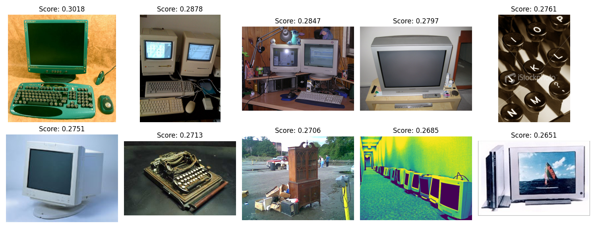

 # Milvus Text-to-Image Search Demo

This project demonstrates text-to-image search capabilities using [Milvus](https://milvus.io/) vector database and OpenAI's [CLIP](https://github.com/openai/CLIP) model. It allows you to search for images using natural language descriptions.

## Overview

Text-to-image search leverages a pretrained multimodal model to convert both text and images into embeddings in a shared semantic space, enabling similarity-based comparisons. This demo shows how to:

1. Generate image embeddings with CLIP
2. Store the embeddings in Milvus
3. Perform efficient similarity searches using text queries

## Prerequisites

The script requires the following dependencies:
- Python 3.8+
- pymilvus (2.4.2+)
- CLIP model (from OpenAI)
- pillow (for image processing)
- matplotlib (for visualization)
- torch (for running CLIP)

## Setup and Installation

The script will automatically handle installation of the required packages. You need to have a working Python environment with pip available.

## Usage

1. Activate the conda environment (if applicable):
```bash
conda activate agent
```

2. Run the script:
```bash
python text_image_search_with_milvus.py
```

The script will:
- Install required dependencies (if needed)
- Download example images (~100 classes from ImageNet)
- Create a Milvus collection
- Process images and store their embeddings in Milvus
- Perform an initial example search for "a white dog"
- Enter an interactive mode where you can enter your own text queries

## Interactive Mode

After the initial setup and example search, you can enter your own text queries to search for images. Enter 'q' to quit the interactive mode.

## Example Queries

Try these example queries:
- "a red sports car"
- "a colorful bird"
- "a mountain landscape"
- "a black and white cat"
- "food on a plate"

## Notes

- The script uses Milvus Lite for simplicity, which stores data in a local file called `milvus.db`.
- Search results are visualized and saved as 'search_results.png' in the current directory.
- For production use, consider using a full Milvus server deployment.

## Results

- "computer"



## Source

This demo is based on the [Milvus Bootcamp tutorial](https://github.com/milvus-io/bootcamp/blob/master/tutorials/quickstart/text_image_search_with_milvus.ipynb).