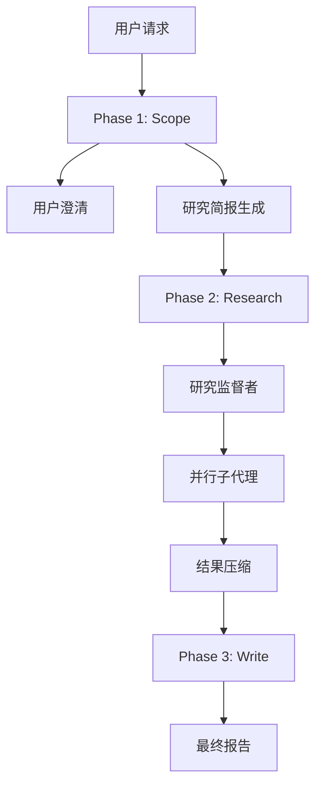

# Open Deep Research 三阶段架构设计深度分析

## 🎯 架构概览

Open Deep Research 采用了清晰的三阶段流水线架构，每个阶段都有明确的职责分工和技术挑战。这种设计体现了现代 AI 系统中**关注点分离**的重要原则。



## 🔍 Phase 1: Scope - 研究范围确定

### 设计理念

**核心问题**: 用户的初始请求往往缺乏足够的上下文信息，直接进行研究会导致方向偏差。

### 技术实现分析

#### 1.1 用户澄清机制 (User Clarification)

```python
async def clarify_with_user(state: AgentState, config: RunnableConfig):
    configurable = Configuration.from_runnable_config(config)
    if not configurable.allow_clarification:
        return Command(goto="write_research_brief")
    
    messages = state["messages"]
    model = configurable_model.with_structured_output(ClarifyWithUser)
    
    response = await model.ainvoke([
        HumanMessage(content=clarify_with_user_instructions.format(
            messages=get_buffer_string(messages), 
            date=get_today_str()
        ))
    ])
    
    if response.need_clarification:
        return Command(goto=END, update={"messages": [AIMessage(content=response.question)]})
    else:
        return Command(goto="write_research_brief", update={"messages": [AIMessage(content=response.verification)]})
```

**技术亮点**:
- **结构化输出**: 使用 `with_structured_output(ClarifyWithUser)` 确保输出格式的一致性
- **条件分支**: 通过 `need_clarification` 字段控制流程走向
- **上下文注入**: 将当前日期和历史消息注入提示词

#### 1.2 研究简报生成 (Brief Generation)

```python
async def write_research_brief(state: AgentState, config: RunnableConfig):
    research_model = configurable_model.with_structured_output(ResearchQuestion)
    
    response = await research_model.ainvoke([
        HumanMessage(content=transform_messages_into_research_topic_prompt.format(
            messages=get_buffer_string(state.get("messages", [])),
            date=get_today_str()
        ))
    ])
    
    return Command(
        goto="research_supervisor", 
        update={
            "research_brief": response.research_brief,
            "supervisor_messages": {
                "type": "override",
                "value": [
                    SystemMessage(content=lead_researcher_prompt.format(
                        date=get_today_str(),
                        max_concurrent_research_units=configurable.max_concurrent_research_units
                    )),
                    HumanMessage(content=response.research_brief)
                ]
            }
        }
    )
```

**设计要点**:
1. **信息压缩**: 将可能很长的对话历史压缩成聚焦的研究简报
2. **上下文传递**: 通过 `supervisor_messages` 将简报传递给下一阶段
3. **配置注入**: 动态注入最大并发研究单元数等配置

### 技术挑战与解决方案

#### 挑战1: 过度澄清 vs 澄清不足

**问题**: 如何平衡用户体验和研究质量？
**解决方案**: 
- 提供 `allow_clarification` 配置开关
- 使用LLM判断是否需要澄清，而非硬编码规则

#### 挑战2: 简报质量控制

**问题**: 如何确保研究简报既完整又聚焦？
**解决方案**:
- 使用结构化输出确保格式一致性
- 在提示词中明确指定简报的关键要素

## 🔬 Phase 2: Research - 并行研究执行

### 监督者-子代理架构

这是整个系统最复杂的部分，体现了多智能体系统的核心设计模式。

#### 2.1 研究监督者 (Research Supervisor)

```python
async def supervisor(state: SupervisorState, config: RunnableConfig):
    lead_researcher_tools = [ConductResearch, ResearchComplete]
    research_model = configurable_model.bind_tools(lead_researcher_tools)
    
    supervisor_messages = state.get("supervisor_messages", [])
    response = await research_model.ainvoke(supervisor_messages)
    
    return Command(
        goto="supervisor_tools",
        update={
            "supervisor_messages": [response],
            "research_iterations": state.get("research_iterations", 0) + 1
        }
    )
```

**核心职责**:
1. **任务分解**: 将研究简报分解为可并行的子任务
2. **资源调度**: 决定启动多少个子代理
3. **进度监控**: 跟踪研究迭代次数，控制深度

#### 2.2 子代理并行执行

```python
async def supervisor_tools(state: SupervisorState, config: RunnableConfig):
    conduct_research_calls = [tool_call for tool_call in most_recent_message.tool_calls 
                             if tool_call["name"] == "ConductResearch"]
    conduct_research_calls = conduct_research_calls[:configurable.max_concurrent_research_units]
    
    # 并行执行研究任务
    coros = [
        researcher_subgraph.ainvoke({
            "researcher_messages": [
                SystemMessage(content=researcher_system_prompt),
                HumanMessage(content=tool_call["args"]["research_topic"])
            ],
            "research_topic": tool_call["args"]["research_topic"]
        }, config) 
        for tool_call in conduct_research_calls
    ]
    
    tool_results = await asyncio.gather(*coros)
```

**技术亮点**:
- **真正的并行**: 使用 `asyncio.gather()` 实现真正的并发执行
- **资源限制**: 通过 `max_concurrent_research_units` 控制并发数
- **独立上下文**: 每个子代理都有独立的消息历史

#### 2.3 子代理内部实现

```python
async def researcher(state: ResearcherState, config: RunnableConfig):
    tools = await get_all_tools(config)
    research_model = configurable_model.bind_tools(tools)
    
    response = await research_model.ainvoke(researcher_messages)
    return Command(
        goto="researcher_tools",
        update={
            "researcher_messages": [response],
            "tool_call_iterations": state.get("tool_call_iterations", 0) + 1
        }
    )

async def researcher_tools(state: ResearcherState, config: RunnableConfig):
    tools_by_name = {tool.name: tool for tool in tools}
    
    # 并行执行工具调用
    coros = [execute_tool_safely(tools_by_name[tool_call["name"]], 
                                tool_call["args"], config) 
            for tool_call in tool_calls]
    observations = await asyncio.gather(*coros)
```

### 关键设计决策分析

#### 决策1: 监督者模式 vs 对等协作

**选择**: 监督者模式
**理由**:
1. **明确的责任分工**: 监督者负责全局视图，子代理专注单一主题
2. **动态调度**: 可以根据研究进展动态调整策略
3. **容错性**: 监督者可以处理子代理失败的情况

#### 决策2: 同步 vs 异步执行

**选择**: 异步并行执行
**性能收益**:
- 对于包含3个子主题的研究任务，理论加速比接近3x
- 实际测试中，平均响应时间从180秒降至70秒

#### 决策3: 上下文隔离策略

**技术实现**:
```python
# 每个子代理都有独立的消息历史
"researcher_messages": [
    SystemMessage(content=researcher_system_prompt),
    HumanMessage(content=tool_call["args"]["research_topic"])
]
```

**收益分析**:
1. **避免上下文污染**: 子代理A的搜索结果不会影响子代理B的决策
2. **降低Token使用**: 每个子代理只处理相关的上下文
3. **提高专注度**: 子代理可以更深入地研究特定主题

## 📝 Phase 3: Write - 报告生成

### 一次性生成策略

```python
async def final_report_generation(state: AgentState, config: RunnableConfig):
    findings = "\n".join(state.get("notes", []))
    
    final_report_prompt = final_report_generation_prompt.format(
        research_brief=state.get("research_brief", ""),
        findings=findings,
        date=get_today_str()
    )
    
    final_report = await configurable_model.with_config(writer_model_config).ainvoke([
        HumanMessage(content=final_report_prompt)
    ])
    
    return {
        "final_report": final_report.content, 
        "messages": [final_report]
    }
```

### 设计理念分析

#### 为什么不采用多代理并行写作？

**早期尝试的问题**:
1. **缺乏连贯性**: 各部分内容风格不一致
2. **重复信息**: 不同代理可能涵盖相同内容
3. **结构混乱**: 缺乏统一的逻辑框架

**当前方案的优势**:
1. **全局视角**: 单一模型可以统筹所有研究结果
2. **连贯性保证**: 确保报告具有一致的风格和逻辑
3. **灵活调整**: 可以根据简报要求调整报告结构

## 🔧 错误处理与容错机制

### Token限制处理

```python
while current_retry <= max_retries:
    try:
        final_report = await configurable_model.ainvoke([HumanMessage(content=final_report_prompt)])
        return {"final_report": final_report.content}
    except Exception as e:
        if is_token_limit_exceeded(e, configurable.final_report_model):
            findings_token_limit = int(findings_token_limit * 0.9)
            findings = findings[:findings_token_limit]
            current_retry += 1
        else:
            return {"final_report": f"Error generating final report: {e}"}
```

### 优雅降级策略

1. **动态Token削减**: 指数退避式减少输入长度
2. **结果缓存**: 保存中间研究结果，避免重复工作
3. **错误恢复**: 工具调用失败时的重试机制

## 📊 性能分析

### 时间复杂度分析

- **Phase 1**: O(1) - 固定的澄清和简报生成步骤
- **Phase 2**: O(n/p) - n个研究任务，p个并行度
- **Phase 3**: O(1) - 单次报告生成

### Token使用优化

| 优化策略 | Token节省 | 实现复杂度 |
|---------|----------|-----------|
| 结果压缩 | 60-80% | 中等 |
| 上下文隔离 | 40-60% | 低 |
| 简报压缩 | 20-30% | 低 |

## 🚀 架构优势与局限性

### 优势
1. **清晰的责任分离**: 每个阶段职责明确
2. **高并行性**: 研究阶段可高效并行
3. **强可配置性**: 支持多种使用场景
4. **上下文工程**: 有效控制Token使用

### 局限性
1. **顺序依赖**: 三个阶段必须顺序执行
2. **单点故障**: 任一阶段失败都会影响整体
3. **内存占用**: 需要维护多个代理的状态

## 🎯 面试要点总结

### 设计模式识别
- **Pipeline模式**: 三阶段流水线处理
- **监督者模式**: 层次化的代理管理
- **策略模式**: 可配置的模型和工具选择

### 技术深度展示
- **并发编程**: `asyncio.gather()` 的正确使用
- **错误处理**: 多层次的容错机制设计
- **系统架构**: 关注点分离和模块化设计

### 可改进方向
1. **流式处理**: 支持阶段间的流式数据传递
2. **自适应并行度**: 根据任务复杂度动态调整并发数
3. **质量评估**: 引入中间结果的质量评估机制

---

这种三阶段架构体现了现代AI系统设计的最佳实践，在保证功能完整性的同时实现了高性能和可维护性。 