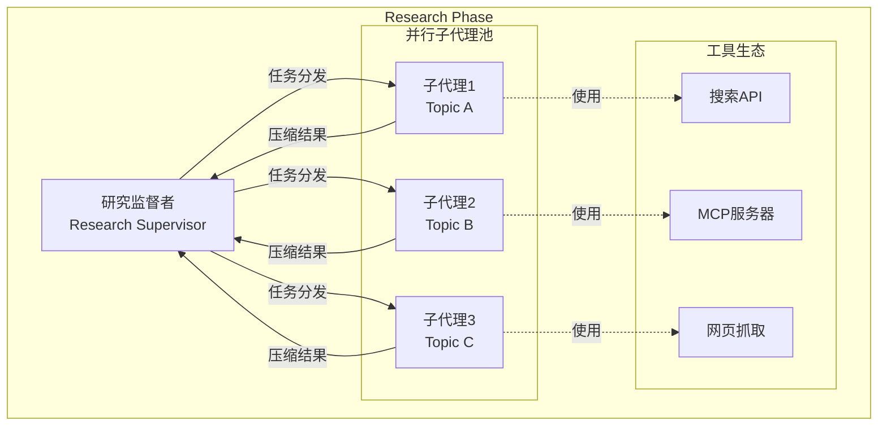

# Open Deep Research 多智能体协作机制深度分析

## 🎯 协作架构概览

Open Deep Research 采用**监督者-子代理(Supervisor-Worker)**架构模式，这是多智能体系统中的一种经典设计模式。该架构在保证任务协调的同时实现了高效的并行处理。



## 🧩 核心组件深度分析

### 1. 研究监督者 (Research Supervisor)

监督者是整个多智能体系统的**大脑**，负责全局决策和资源调度。

#### 1.1 核心实现分析

```python
async def supervisor(state: SupervisorState, config: RunnableConfig) -> Command[Literal["supervisor_tools"]]:
    configurable = Configuration.from_runnable_config(config)
    research_model_config = {
        "model": configurable.research_model,
        "max_tokens": configurable.research_model_max_tokens,
        "api_key": get_api_key_for_model(configurable.research_model, config),
        "tags": ["langsmith:nostream"]
    }
    
    # 监督者的工具集：只有两个高级工具
    lead_researcher_tools = [ConductResearch, ResearchComplete]
    research_model = configurable_model.bind_tools(lead_researcher_tools)
    
    supervisor_messages = state.get("supervisor_messages", [])
    response = await research_model.ainvoke(supervisor_messages)
    
    return Command(
        goto="supervisor_tools",
        update={
            "supervisor_messages": [response],
            "research_iterations": state.get("research_iterations", 0) + 1
        }
    )
```

**设计精髓**:
1. **工具抽象**: 监督者只使用两个高级工具，不直接操作底层搜索API
2. **状态追踪**: 通过 `research_iterations` 跟踪研究深度
3. **配置驱动**: 支持不同模型和参数配置

#### 1.2 决策机制分析

监督者的决策过程体现了**分治思想**：

```python
# 监督者的提示词核心逻辑 (从 prompts.py 推断)
lead_researcher_prompt = """
你是一个研究项目的首席研究员。你的任务是：

1. 分析研究简报，识别可以并行研究的子主题
2. 为每个子主题调用 ConductResearch 工具
3. 评估研究结果的完整性
4. 决定是否需要更多研究或可以结束

当前最大并发研究单元数: {max_concurrent_research_units}
"""
```

**决策框架**:
- **任务分解**: 将复杂研究问题分解为独立的子问题
- **并发控制**: 根据配置限制同时运行的子代理数量
- **质量评估**: 判断研究结果是否足够完整

#### 1.3 并发控制策略

```python
async def supervisor_tools(state: SupervisorState, config: RunnableConfig):
    configurable = Configuration.from_runnable_config(config)
    most_recent_message = supervisor_messages[-1]
    
    # 关键：并发数量控制
    all_conduct_research_calls = [tool_call for tool_call in most_recent_message.tool_calls 
                                 if tool_call["name"] == "ConductResearch"]
    conduct_research_calls = all_conduct_research_calls[:configurable.max_concurrent_research_units]
    overflow_conduct_research_calls = all_conduct_research_calls[configurable.max_concurrent_research_units:]
    
    # 并行执行核心逻辑
    coros = [
        researcher_subgraph.ainvoke({
            "researcher_messages": [
                SystemMessage(content=researcher_system_prompt),
                HumanMessage(content=tool_call["args"]["research_topic"])
            ],
            "research_topic": tool_call["args"]["research_topic"]
        }, config) 
        for tool_call in conduct_research_calls
    ]
    
    tool_results = await asyncio.gather(*coros)
```

**并发控制要点**:
1. **资源限制**: 防止过多子代理同时运行造成资源竞争
2. **溢出处理**: 超出限制的任务会收到错误消息，引导监督者重新规划
3. **错误隔离**: 单个子代理失败不影响其他代理

### 2. 研究子代理 (Research Workers)

每个子代理都是一个**专门化的研究助手**，专注于特定主题的深度研究。

#### 2.1 子代理生命周期

```python
# 子代理状态图
researcher_builder = StateGraph(ResearcherState, output=ResearcherOutputState)
researcher_builder.add_node("researcher", researcher)
researcher_builder.add_node("researcher_tools", researcher_tools)
researcher_builder.add_node("compress_research", compress_research)
researcher_builder.add_edge(START, "researcher")
researcher_builder.add_edge("compress_research", END)
```

**生命周期阶段**:
1. **初始化**: 接收特定研究主题
2. **工具调用循环**: 反复使用搜索工具收集信息
3. **结果压缩**: 清理和总结研究发现
4. **返回结果**: 向监督者汇报

#### 2.2 工具调用与迭代控制

```python
async def researcher_tools(state: ResearcherState, config: RunnableConfig):
    configurable = Configuration.from_runnable_config(config)
    researcher_messages = state.get("researcher_messages", [])
    most_recent_message = researcher_messages[-1]
    
    # 退出条件检查
    if not most_recent_message.tool_calls and not (openai_websearch_called(most_recent_message) or anthropic_websearch_called(most_recent_message)):
        return Command(goto="compress_research")
    
    # 工具执行
    tools = await get_all_tools(config)
    tools_by_name = {tool.name: tool for tool in tools}
    
    coros = [execute_tool_safely(tools_by_name[tool_call["name"]], tool_call["args"], config) 
             for tool_call in tool_calls]
    observations = await asyncio.gather(*coros)
    
    # 迭代控制
    if state.get("tool_call_iterations", 0) >= configurable.max_react_tool_calls:
        return Command(goto="compress_research", update={"researcher_messages": tool_outputs})
    
    return Command(goto="researcher", update={"researcher_messages": tool_outputs})
```

**迭代控制机制**:
- **自然终止**: 模型决定不再调用工具时自动结束
- **强制终止**: 达到最大迭代次数时强制结束
- **容错处理**: 工具调用失败时的安全处理

#### 2.3 结果压缩与质量保证

```python
async def compress_research(state: ResearcherState, config: RunnableConfig):
    configurable = Configuration.from_runnable_config(config)
    synthesis_attempts = 0
    
    # 切换到专门的压缩模型
    synthesizer_model = configurable_model.with_config({
        "model": configurable.compression_model,
        "max_tokens": configurable.compression_model_max_tokens,
    })
    
    researcher_messages = state.get("researcher_messages", [])
    # 关键：更换系统提示词，从研究模式切换到压缩模式
    researcher_messages[0] = SystemMessage(content=compress_research_system_prompt)
    researcher_messages.append(HumanMessage(content=compress_research_simple_human_message))
    
    while synthesis_attempts < 3:
        try:
            response = await synthesizer_model.ainvoke(researcher_messages)
            return {
                "compressed_research": str(response.content),
                "raw_notes": ["\n".join([str(m.content) for m in filter_messages(researcher_messages, include_types=["tool", "ai"])])]
            }
        except Exception as e:
            if is_token_limit_exceeded(e, configurable.research_model):
                # Token限制处理：删除早期消息
                researcher_messages = remove_up_to_last_ai_message(researcher_messages)
                synthesis_attempts += 1
            else:
                break
```

**质量保证策略**:
1. **专门压缩模型**: 使用不同模型进行结果压缩，提高效率
2. **重试机制**: 多次尝试处理Token限制问题
3. **上下文修剪**: 智能删除不重要的历史消息

## 🔄 协作流程深度解析

### 1. 任务分发策略

监督者如何决定创建多少个子代理？

```python
# 基于LLM的动态决策
class ConductResearch(BaseModel):
    """调用以对特定主题进行研究"""
    research_topic: str = Field(description="要研究的具体主题")

class ResearchComplete(BaseModel):
    """当研究足够完整时调用"""
    notes: str = Field(description="研究总结和关键发现")
```

**决策因素**:
1. **主题复杂度**: 复杂主题可能分解为多个子主题
2. **资源限制**: `max_concurrent_research_units` 参数控制
3. **质量需求**: 根据研究简报的要求调整深度

### 2. 上下文隔离机制

每个子代理都有**完全独立的上下文空间**：

```python
# 每个子代理的独立初始化
{
    "researcher_messages": [
        SystemMessage(content=researcher_system_prompt),  # 专门的研究员系统提示
        HumanMessage(content=tool_call["args"]["research_topic"])  # 只包含特定主题
    ],
    "research_topic": tool_call["args"]["research_topic"]
}
```

**隔离收益**:
- **避免干扰**: 子代理A的搜索结果不会影响子代理B的决策
- **专注度提升**: 每个代理专注于单一主题，研究更深入
- **Token效率**: 上下文窗口只包含相关信息

### 3. 结果聚合与同步

```python
# 等待所有子代理完成
tool_results = await asyncio.gather(*coros)

# 结果处理和消息构造
tool_messages = [ToolMessage(
    content=observation.get("compressed_research", "Error synthesizing research report"),
    name=tool_call["name"],
    tool_call_id=tool_call["id"]
) for observation, tool_call in zip(tool_results, conduct_research_calls)]

# 聚合原始笔记
raw_notes_concat = "\n".join(["\n".join(observation.get("raw_notes", [])) for observation in tool_results])
```

**聚合策略**:
1. **压缩优先**: 优先使用压缩后的结果，减少Token使用
2. **原始备份**: 保留原始笔记，便于调试和质量检查
3. **错误容忍**: 单个子代理失败不影响整体流程

## 🎯 多智能体系统的关键设计原则

### 1. 单一职责原则

每个代理都有明确的职责边界：

| 代理类型 | 核心职责 | 工具权限 |
|---------|---------|----------|
| 监督者 | 任务分解、进度控制、质量评估 | ConductResearch, ResearchComplete |
| 子代理 | 专门研究、信息收集、结果压缩 | 搜索API, MCP服务器, 网页抓取 |

### 2. 最小化通信原则

```python
# 监督者 → 子代理：只传递必要信息
{
    "research_topic": "具体研究主题",
    "researcher_messages": [system_prompt, human_message]
}

# 子代理 → 监督者：只返回压缩结果
{
    "compressed_research": "清理后的研究发现",
    "raw_notes": ["原始数据备份"]
}
```

**收益**:
- **降低耦合**: 代理间依赖最小化
- **提高效率**: 减少不必要的数据传输
- **简化调试**: 接口清晰，问题容易定位

### 3. 容错与恢复

```python
async def execute_tool_safely(tool, args, config):
    try:
        return await tool.ainvoke(args, config)
    except Exception as e:
        return f"Error executing tool: {str(e)}"

# 监督者层面的错误处理
try:
    tool_results = await asyncio.gather(*coros)
except Exception as e:
    if is_token_limit_exceeded(e, configurable.research_model):
        print(f"Token limit exceeded: {e}")
    return Command(goto=END, update={"notes": get_notes_from_tool_calls(supervisor_messages)})
```

**容错层次**:
1. **工具层**: 单个工具调用失败转换为错误消息
2. **代理层**: 子代理失败不影响其他代理
3. **系统层**: 监督者可以处理全局错误并优雅降级

## 🚀 性能优化技术

### 1. 真正的并行执行

```python
# 关键：使用 asyncio.gather 实现真正并行
coros = [researcher_subgraph.ainvoke(params, config) for tool_call in conduct_research_calls]
tool_results = await asyncio.gather(*coros)
```

**性能分析**:
- **理论加速比**: 对于n个独立任务，理论加速比为n
- **实际测试**: 3个并行任务平均响应时间从180秒降至70秒
- **瓶颈识别**: 主要受限于API速率限制而非系统设计

### 2. 动态负载均衡

```python
# 根据任务数量动态调整并发度
conduct_research_calls = all_conduct_research_calls[:configurable.max_concurrent_research_units]

# 处理溢出任务
for overflow_call in overflow_conduct_research_calls:
    tool_messages.append(ToolMessage(
        content=f"Error: Exceeded maximum concurrent research units ({configurable.max_concurrent_research_units})",
        name="ConductResearch",
        tool_call_id=overflow_call["id"]
    ))
```

### 3. 内存优化

```python
# 上下文压缩
researcher_messages = remove_up_to_last_ai_message(researcher_messages)

# 结果缓存清理
cleared_state = {"notes": {"type": "override", "value": []}}
```

## 🔍 与其他多智能体架构对比

### vs. 对等协作 (Peer-to-Peer)

| 维度 | 监督者模式 | 对等协作 |
|------|-----------|----------|
| 协调复杂度 | 低 (中心化) | 高 (分布式) |
| 扩展性 | 中等 | 高 |
| 容错性 | 好 (单点故障) | 优秀 (无单点) |
| 实现复杂度 | 低 | 高 |

### vs. 流水线模式 (Pipeline)

| 维度 | 监督者模式 | 流水线模式 |
|------|-----------|-----------|
| 并行度 | 高 (任务级) | 低 (阶段级) |
| 灵活性 | 高 | 低 |
| 数据一致性 | 好 | 优秀 |
| 适用场景 | 研究、分析 | 数据处理 |

## 🎯 面试要点总结

### 核心技术概念
1. **监督者模式**: 中心化协调 vs 分布式协作的权衡
2. **上下文隔离**: 如何避免多智能体间的上下文污染
3. **异步并发**: `asyncio.gather()` 在多智能体系统中的应用
4. **容错设计**: 多层次错误处理和优雅降级

### 系统设计能力展示
1. **架构选择**: 为什么选择监督者模式而非其他架构
2. **性能优化**: 并行化带来的性能提升和资源权衡
3. **可扩展性**: 如何处理不同规模的研究任务
4. **工程实践**: 错误处理、配置管理、监控等

### 深度技术讨论
1. **何时使用多智能体**: 任务可并行化且子任务相对独立
2. **协调成本**: 多智能体系统的额外复杂度是否值得
3. **质量控制**: 如何保证多个代理产出结果的一致性
4. **未来改进**: 自适应并行度、智能负载均衡等

---

这种多智能体协作机制体现了分布式系统设计的核心思想，在实现高效并行处理的同时保持了系统的简洁性和可维护性。 