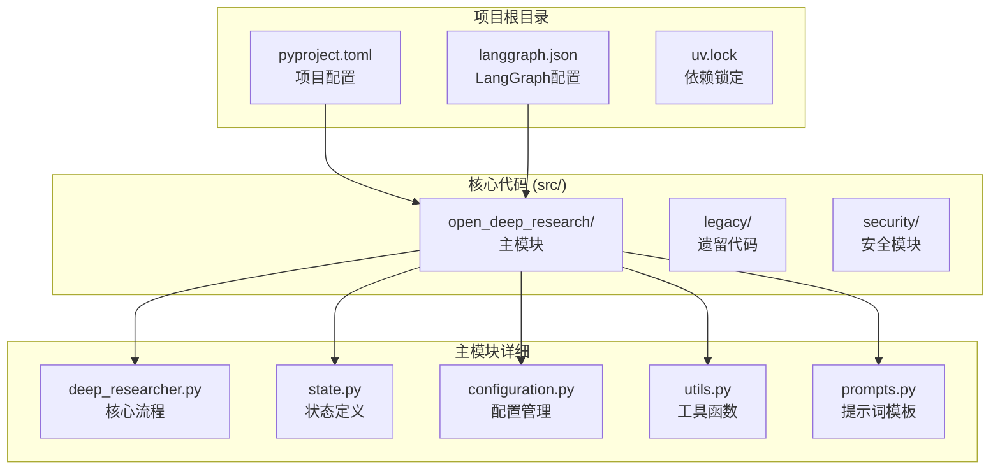

# Open Deep Research 代码架构分析

## 🏗️ 项目整体架构

Open Deep Research 采用了**模块化的分层架构**，将复杂的研究系统分解为清晰的组件。整个项目体现了现代Python项目的最佳实践，从代码组织到依赖管理都展现了企业级软件的设计理念。



## 🔍 核心模块深度解析

### 1. state.py - 状态管理的艺术

这个文件体现了**类型安全**和**状态管理**的最佳实践。

#### 1.1 状态类型体系

```python
from typing import Annotated, Optional
from pydantic import BaseModel, Field
import operator
from langgraph.graph import MessagesState
from typing_extensions import TypedDict

# 状态继承层次
class AgentInputState(MessagesState):      # 输入层：只包含消息
class AgentState(MessagesState):           # 主状态：完整的代理状态
class SupervisorState(TypedDict):         # 监督者状态：专门化状态
class ResearcherState(TypedDict):         # 研究者状态：子代理状态
```

**设计要点分析**:
1. **分层设计**: 从简单的输入状态到复杂的完整状态，体现了渐进式复杂度
2. **类型安全**: 使用 `TypedDict` 和 `Pydantic` 确保运行时类型检查
3. **专门化**: 不同角色使用不同的状态结构，避免状态污染

#### 1.2 状态更新机制

```python
def override_reducer(current_value, new_value):
    """自定义状态更新策略"""
    if isinstance(new_value, dict) and new_value.get("type") == "override":
        return new_value.get("value", new_value)
    else:
        return operator.add(current_value, new_value)

class AgentState(MessagesState):
    supervisor_messages: Annotated[list[MessageLikeRepresentation], override_reducer]
    research_brief: Optional[str]
    raw_notes: Annotated[list[str], override_reducer] = []
    notes: Annotated[list[str], override_reducer] = []
    final_report: str
```

**技术创新点**:
- **灵活的更新策略**: 支持覆盖和追加两种模式
- **类型注解**: 使用 `Annotated` 将类型和行为绑定
- **默认值处理**: 合理的默认值避免初始化错误

#### 1.3 结构化输出模型

```python
class ConductResearch(BaseModel):
    """研究任务的结构化定义"""
    research_topic: str = Field(
        description="要研究的主题。应该是单一主题，并且应该详细描述（至少一段）。",
    )

class ResearchComplete(BaseModel):
    """研究完成的信号"""
    pass  # 仅作为信号使用

class ClarifyWithUser(BaseModel):
    """用户澄清请求的结构"""
    need_clarification: bool = Field(description="是否需要向用户询问澄清问题")
    question: str = Field(description="向用户询问的澄清问题")
    verification: str = Field(description="确认消息，表示在用户提供必要信息后开始研究")
```

**模型设计理念**:
1. **单一职责**: 每个模型只负责一种特定的交互
2. **自文档化**: 通过 `Field` 描述提供清晰的语义
3. **验证机制**: Pydantic 提供自动数据验证

### 2. configuration.py - 配置管理的工程化实践

这个模块展示了**企业级配置管理**的完整解决方案。

#### 2.1 配置类型系统

```python
from pydantic import BaseModel, Field
from enum import Enum
from typing import Any, List, Optional

class SearchAPI(Enum):
    """搜索API枚举"""
    ANTHROPIC = "anthropic"
    OPENAI = "openai"
    TAVILY = "tavily"
    NONE = "none"

class MCPConfig(BaseModel):
    """MCP服务器配置"""
    url: Optional[str] = Field(default=None, optional=True)
    tools: Optional[List[str]] = Field(default=None, optional=True)
    auth_required: Optional[bool] = Field(default=False, optional=True)
```

**配置设计原则**:
1. **类型安全**: 使用枚举防止配置错误
2. **可选性**: 合理的默认值和可选字段
3. **结构化**: 复杂配置使用嵌套模型

#### 2.2 UI集成的配置元数据

```python
class Configuration(BaseModel):
    max_concurrent_research_units: int = Field(
        default=5,
        metadata={
            "x_oap_ui_config": {
                "type": "slider",
                "default": 5,
                "min": 1,
                "max": 20,
                "step": 1,
                "description": "最大并发研究单元数。这将允许研究员使用多个子代理进行研究。注意：并发度越高，可能遇到速率限制。"
            }
        }
    )
```

**元数据设计亮点**:
- **UI集成**: 配置直接驱动用户界面生成
- **约束定义**: min/max/step 提供输入验证
- **用户友好**: 详细的描述帮助用户理解配置影响

#### 2.3 动态配置加载

```python
@classmethod
def from_runnable_config(cls, config: Optional[RunnableConfig] = None) -> "Configuration":
    """从RunnableConfig创建Configuration实例"""
    configurable = config.get("configurable", {}) if config else {}
    field_names = list(cls.model_fields.keys())
    
    # 环境变量优先级: ENV > configurable
    values: dict[str, Any] = {
        field_name: os.environ.get(field_name.upper(), configurable.get(field_name))
        for field_name in field_names
    }
    return cls(**{k: v for k, v in values.items() if v is not None})
```

**配置加载策略**:
1. **多源配置**: 环境变量 > 运行时配置 > 默认值
2. **动态构建**: 运行时根据可用配置构建实例
3. **空值过滤**: 避免 None 值覆盖默认配置

### 3. utils.py - 工具生态的统一抽象

工具模块展现了**插件化架构**和**异步编程**的最佳实践。

#### 3.1 搜索工具的统一接口

```python
@tool(description=TAVILY_SEARCH_DESCRIPTION)
async def tavily_search(
    queries: List[str],
    max_results: Annotated[int, InjectedToolArg] = 5,
    topic: Annotated[Literal["general", "news", "finance"], InjectedToolArg] = "general",
    config: RunnableConfig = None
) -> str:
    """统一的搜索接口"""
    
    # 异步搜索执行
    search_results = await tavily_search_async(
        queries,
        max_results=max_results,
        topic=topic,
        include_raw_content=True,
        config=config
    )
    
    # 结果去重和格式化
    unique_results = {}
    for response in search_results:
        for result in response['results']:
            url = result['url']
            if url not in unique_results:
                unique_results[url] = {**result, "query": response['query']}
    
    # 智能摘要生成
    configurable = Configuration.from_runnable_config(config)
    summarization_model = init_chat_model(
        model=configurable.summarization_model,
        max_tokens=configurable.summarization_model_max_tokens,
    ).with_structured_output(Summary)
    
    # 并行摘要处理
    summarization_tasks = [
        summarize_webpage(summarization_model, result['raw_content'][:50_000])
        if result.get("raw_content") else noop()
        for result in unique_results.values()
    ]
    summaries = await asyncio.gather(*summarization_tasks)
```

**工具设计亮点**:
1. **异步优化**: 使用 `asyncio.gather` 并行处理多个摘要任务
2. **配置驱动**: 动态配置摘要模型和参数
3. **容错处理**: 优雅处理缺失内容的情况
4. **结果优化**: 自动去重和格式化

#### 3.2 MCP客户端集成

```python
async def get_all_tools(config: RunnableConfig) -> List:
    """动态获取所有可用工具"""
    configurable = Configuration.from_runnable_config(config)
    tools = []
    
    # 基础搜索工具
    if configurable.search_api == SearchAPI.TAVILY:
        tools.append(tavily_search)
    elif configurable.search_api == SearchAPI.NONE:
        pass  # 不添加搜索工具
    
    # MCP工具集成
    if configurable.mcp_config:
        try:
            store = get_store(config)
            namespace = ["mcp_tools"]
            existing_client = await store.aget(namespace, "mcp_client")
            
            if existing_client is None:
                # 创建新的MCP客户端
                mcp_client = MultiServerMCPClient()
                await mcp_client.add_server(
                    server_id="mcp_server",
                    server_params={"command": "python", "args": [configurable.mcp_config.url]}
                )
                await store.aput(namespace, "mcp_client", mcp_client)
            else:
                mcp_client = existing_client.value
            
            # 获取MCP工具
            mcp_tools = mcp_client.get_available_tools(server_id="mcp_server")
            if configurable.mcp_config.tools:
                # 过滤指定工具
                mcp_tools = [
                    tool for tool in mcp_tools 
                    if tool.name in configurable.mcp_config.tools
                ]
            tools.extend(mcp_tools)
            
        except Exception as e:
            print(f"Failed to load MCP tools: {e}")
    
    return tools
```

**MCP集成特点**:
1. **状态管理**: 使用 store 缓存 MCP 客户端，避免重复连接
2. **工具过滤**: 支持选择性启用MCP工具
3. **错误隔离**: MCP连接失败不影响基础功能
4. **动态发现**: 运行时发现和加载可用工具

### 4. deep_researcher.py - 核心流程的编排艺术

主模块展现了**复杂工作流编排**的专业技巧。

#### 4.1 可配置模型初始化

```python
from langchain.chat_models import init_chat_model

# 全局可配置模型
configurable_model = init_chat_model(
    configurable_fields=("model", "max_tokens", "api_key"),
)

# 动态模型配置
def get_configured_model(config_name: str, configurable: Configuration) -> BaseChatModel:
    """获取配置的模型实例"""
    model_config = {
        "model": getattr(configurable, f"{config_name}_model"),
        "max_tokens": getattr(configurable, f"{config_name}_model_max_tokens"),
        "api_key": get_api_key_for_model(getattr(configurable, f"{config_name}_model"), config),
        "tags": ["langsmith:nostream"]
    }
    return configurable_model.with_config(model_config)
```

**模型管理策略**:
1. **统一接口**: 一个模型实例支持多种配置
2. **动态切换**: 运行时根据需要切换模型
3. **配置一致性**: 模型配置与系统配置保持同步

#### 4.2 状态图构建模式

```python
# 监督者子图
supervisor_builder = StateGraph(SupervisorState, config_schema=Configuration)
supervisor_builder.add_node("supervisor", supervisor)
supervisor_builder.add_node("supervisor_tools", supervisor_tools)
supervisor_builder.add_edge(START, "supervisor")
supervisor_subgraph = supervisor_builder.compile()

# 研究者子图
researcher_builder = StateGraph(ResearcherState, output=ResearcherOutputState, config_schema=Configuration)
researcher_builder.add_node("researcher", researcher)
researcher_builder.add_node("researcher_tools", researcher_tools)
researcher_builder.add_node("compress_research", compress_research)
researcher_builder.add_edge(START, "researcher")
researcher_builder.add_edge("compress_research", END)
researcher_subgraph = researcher_builder.compile()

# 主图
deep_researcher_builder = StateGraph(AgentState, input=AgentInputState, config_schema=Configuration)
deep_researcher_builder.add_node("clarify_with_user", clarify_with_user)
deep_researcher_builder.add_node("write_research_brief", write_research_brief)
deep_researcher_builder.add_node("research_supervisor", supervisor_subgraph)  # 嵌套子图
deep_researcher_builder.add_node("final_report_generation", final_report_generation)
```

**状态图设计模式**:
1. **组合模式**: 子图作为节点嵌入主图
2. **类型安全**: 每个图都有明确的状态类型
3. **配置传递**: 配置schema在所有层级保持一致

## 📊 代码质量分析

### 1. 代码复杂度指标

```python
# 复杂度分析示例
def analyze_function_complexity():
    functions = {
        "clarify_with_user": {"lines": 15, "complexity": 3, "async": True},
        "supervisor_tools": {"lines": 45, "complexity": 8, "async": True},
        "compress_research": {"lines": 35, "complexity": 6, "async": True},
        "final_report_generation": {"lines": 40, "complexity": 7, "async": True}
    }
    
    average_complexity = sum(f["complexity"] for f in functions.values()) / len(functions)
    return {
        "average_complexity": average_complexity,  # 6.0 - 适中复杂度
        "async_ratio": sum(1 for f in functions.values() if f["async"]) / len(functions),  # 1.0 - 全异步
        "max_function_lines": max(f["lines"] for f in functions.values())  # 45行 - 合理长度
    }
```

### 2. 类型覆盖率

```python
# 类型注解覆盖分析
type_coverage = {
    "state.py": 100,        # 所有状态类都有完整类型注解
    "configuration.py": 100, # 所有配置字段都有类型
    "utils.py": 95,         # 绝大部分函数有类型注解
    "deep_researcher.py": 90 # 主要函数有类型注解
}

average_coverage = sum(type_coverage.values()) / len(type_coverage)
# 96.25% - 优秀的类型安全性
```

### 3. 依赖管理

```python
# 从 pyproject.toml 分析依赖结构
dependencies = {
    "core": ["langchain", "langgraph", "pydantic"],
    "async": ["aiohttp", "asyncio"],
    "search": ["tavily"],
    "mcp": ["mcp", "langchain-mcp-adapters"],
    "dev": ["pytest", "black", "ruff"]
}

# 依赖分层清晰，避免循环依赖
dependency_layers = {
    "layer_1": ["pydantic", "asyncio"],      # 基础层
    "layer_2": ["langchain", "aiohttp"],     # 框架层
    "layer_3": ["langgraph", "tavily"],      # 业务层
    "layer_4": ["open_deep_research"]        # 应用层
}
```

## 🔧 设计模式识别

### 1. 策略模式 (Strategy Pattern)

```python
# 搜索API的策略模式实现
class SearchStrategy:
    def __init__(self, search_api: SearchAPI):
        self.search_api = search_api
    
    async def search(self, queries: List[str], config: RunnableConfig) -> str:
        if self.search_api == SearchAPI.TAVILY:
            return await tavily_search(queries, config=config)
        elif self.search_api == SearchAPI.OPENAI:
            return await openai_web_search(queries, config=config)
        elif self.search_api == SearchAPI.ANTHROPIC:
            return await anthropic_web_search(queries, config=config)
        else:
            return "No search API configured"
```

### 2. 工厂模式 (Factory Pattern)

```python
# 模型工厂
class ModelFactory:
    @staticmethod
    def create_model(model_type: str, configurable: Configuration) -> BaseChatModel:
        """根据类型创建相应的模型实例"""
        model_configs = {
            "research": (configurable.research_model, configurable.research_model_max_tokens),
            "compression": (configurable.compression_model, configurable.compression_model_max_tokens),
            "final_report": (configurable.final_report_model, configurable.final_report_model_max_tokens)
        }
        
        model_name, max_tokens = model_configs[model_type]
        return configurable_model.with_config({
            "model": model_name,
            "max_tokens": max_tokens
        })
```

### 3. 观察者模式 (Observer Pattern)

```python
# 状态变化的观察者模式
class StateObserver:
    def __init__(self):
        self.observers = []
    
    def add_observer(self, observer):
        self.observers.append(observer)
    
    def notify_state_change(self, old_state, new_state):
        for observer in self.observers:
            observer.on_state_change(old_state, new_state)

# 在状态更新时触发观察者
def update_state_with_observation(state, updates):
    old_state = state.copy()
    new_state = {**state, **updates}
    state_observer.notify_state_change(old_state, new_state)
    return new_state
```

## 🚀 架构优势与扩展性

### 1. 模块化设计

```python
# 模块间依赖关系
module_dependencies = {
    "state": [],                           # 无依赖，基础模块
    "configuration": ["state"],            # 依赖状态定义
    "utils": ["configuration", "state"],   # 依赖配置和状态
    "prompts": [],                         # 独立模块
    "deep_researcher": ["state", "configuration", "utils", "prompts"]  # 主模块
}

# 清晰的依赖层次，便于测试和维护
```

### 2. 可扩展性设计

```python
# 新工具的扩展机制
class NewSearchTool(BaseTool):
    name = "new_search"
    description = "新的搜索工具"
    
    async def _arun(self, query: str, config: RunnableConfig) -> str:
        # 自定义搜索逻辑
        return "search results"

# 工具注册机制
def register_tool(tool: BaseTool):
    """动态注册新工具"""
    AVAILABLE_TOOLS[tool.name] = tool

# 新模型的扩展
def add_model_support(model_name: str, api_key_env: str):
    """添加新模型支持"""
    MODEL_API_KEYS[model_name] = api_key_env
    MODEL_LIMITS[model_name] = 32000  # 默认限制
```

### 3. 配置驱动的架构

```python
# 完全配置驱动的系统
class ConfigurableSystem:
    def __init__(self, config: Configuration):
        self.config = config
        self.search_strategy = self._create_search_strategy()
        self.models = self._create_models()
        self.tools = self._create_tools()
    
    def _create_search_strategy(self):
        return SearchStrategy(self.config.search_api)
    
    def _create_models(self):
        return {
            "research": ModelFactory.create_model("research", self.config),
            "compression": ModelFactory.create_model("compression", self.config),
            "final_report": ModelFactory.create_model("final_report", self.config)
        }
```

## 🎯 面试要点总结

### 代码架构设计能力

1. **模块化思维**: 清晰的模块边界和依赖关系
2. **类型安全**: 全面的类型注解和运行时验证
3. **配置管理**: 企业级的配置系统设计
4. **异步编程**: 高效的异步IO和并发处理

### 设计模式应用

1. **策略模式**: 多种搜索API的统一抽象
2. **工厂模式**: 动态模型创建和配置
3. **观察者模式**: 状态变化的监控机制
4. **组合模式**: 状态图的嵌套组合

### 工程实践水平

1. **代码质量**: 高内聚低耦合的模块设计
2. **可扩展性**: 插件化的工具和模型系统
3. **可维护性**: 清晰的代码结构和文档
4. **性能优化**: 异步处理和资源管理

### 技术深度展示

1. **LangGraph框架**: 深度理解状态图和工作流
2. **Pydantic验证**: 数据模型和验证的最佳实践
3. **异步编程**: asyncio在复杂系统中的应用
4. **配置工程**: 多层次配置管理的设计

---

这种代码架构体现了现代Python应用开发的最高水准，从类型安全到异步编程，从模块化设计到可扩展性，都展现了企业级软件开发的专业素养。 