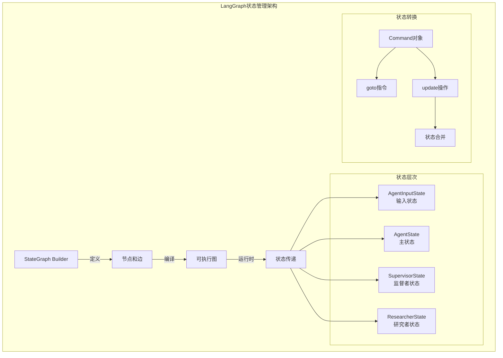

# Open Deep Research 状态管理与流程控制深度分析

## 🎯 LangGraph状态图核心概念

Open Deep Research基于**LangGraph框架**构建了复杂的多智能体工作流。LangGraph是一个专门为构建有状态的多智能体应用而设计的框架，它将工作流抽象为**有向图**，其中节点代表计算步骤，边代表状态转换。



## 🔧 状态定义与类型系统

### 1. 分层状态架构

Open Deep Research采用了**分层状态设计**，每个层次负责不同范围的状态管理。

#### 1.1 基础状态层 - MessagesState

```python
from langgraph.graph import MessagesState
from langchain_core.messages import MessageLikeRepresentation

class AgentInputState(MessagesState):
    """最简单的输入状态，只包含消息列表"""
    pass  # 继承 MessagesState 的 messages 字段

# MessagesState 内部结构 (框架提供)
class MessagesState(TypedDict):
    messages: Annotated[Sequence[MessageLikeRepresentation], add_messages]
```

**设计理念**:
1. **渐进式复杂度**: 从最简单的消息状态开始
2. **框架集成**: 直接利用LangGraph的内置消息管理
3. **类型安全**: 明确的消息类型约束

#### 1.2 完整状态层 - AgentState

```python
class AgentState(MessagesState):
    """完整的代理状态，包含整个工作流的所有状态信息"""
    
    # 监督者专用消息通道
    supervisor_messages: Annotated[list[MessageLikeRepresentation], override_reducer]
    
    # 研究简报
    research_brief: Optional[str]
    
    # 原始研究笔记
    raw_notes: Annotated[list[str], override_reducer] = []
    
    # 处理后的研究笔记
    notes: Annotated[list[str], override_reducer] = []
    
    # 最终报告
    final_report: str
```

**状态字段设计**:
- **消息隔离**: `supervisor_messages` 与主消息流分离
- **数据管道**: `raw_notes` → `notes` → `final_report` 的数据流
- **可选字段**: `research_brief` 支持跳过澄清阶段

#### 1.3 专门化状态层

```python
class SupervisorState(TypedDict):
    """监督者专用状态 - 轻量化设计"""
    supervisor_messages: Annotated[list[MessageLikeRepresentation], override_reducer]
    research_brief: str
    notes: Annotated[list[str], override_reducer] = []
    research_iterations: int = 0  # 监督者迭代计数器
    raw_notes: Annotated[list[str], override_reducer] = []

class ResearcherState(TypedDict):
    """研究者专用状态 - 专注单一任务"""
    researcher_messages: Annotated[list[MessageLikeRepresentation], operator.add]
    tool_call_iterations: int = 0  # 工具调用计数器
    research_topic: str             # 当前研究主题
    compressed_research: str        # 压缩后的研究结果
    raw_notes: Annotated[list[str], override_reducer] = []
```

**专门化设计优势**:
1. **状态隔离**: 每个角色只访问必要的状态
2. **性能优化**: 减少状态序列化开销
3. **类型安全**: 编译时检查状态字段使用

### 2. 高级状态管理机制

#### 2.1 自定义状态归约器

```python
def override_reducer(current_value, new_value):
    """支持覆盖和追加两种状态更新模式"""
    if isinstance(new_value, dict) and new_value.get("type") == "override":
        # 覆盖模式：完全替换当前值
        return new_value.get("value", new_value)
    else:
        # 追加模式：合并到现有值
        return operator.add(current_value, new_value)

# 使用示例
supervisor_messages: Annotated[list[MessageLikeRepresentation], override_reducer]
```

**归约器设计模式**:
- **灵活性**: 支持不同的状态更新语义
- **显式控制**: 通过类型标记明确指定更新方式
- **向后兼容**: 默认行为为追加模式

#### 2.2 状态更新的Command模式

```python
from langgraph.types import Command
from typing import Literal

# 状态更新示例
async def clarify_with_user(state: AgentState, config: RunnableConfig) -> Command[Literal["write_research_brief", "__end__"]]:
    # ... 业务逻辑 ...
    
    if response.need_clarification:
        # 终止流程，返回澄清问题
        return Command(
            goto=END, 
            update={"messages": [AIMessage(content=response.question)]}
        )
    else:
        # 继续流程，进入下一阶段
        return Command(
            goto="write_research_brief", 
            update={"messages": [AIMessage(content=response.verification)]}
        )
```

**Command模式优势**:
1. **类型安全**: 编译时检查目标节点
2. **状态一致性**: 原子性的状态更新
3. **流程控制**: 明确的下一步指令

## 🔄 工作流编排与控制

### 1. 状态图构建模式

#### 1.1 主图构建

```python
from langgraph.graph import StateGraph, START, END

# 主工作流图
deep_researcher_builder = StateGraph(
    AgentState,                    # 状态类型
    input=AgentInputState,         # 输入类型
    config_schema=Configuration    # 配置schema
)

# 添加节点
deep_researcher_builder.add_node("clarify_with_user", clarify_with_user)
deep_researcher_builder.add_node("write_research_brief", write_research_brief)
deep_researcher_builder.add_node("research_supervisor", supervisor_subgraph)  # 嵌套子图
deep_researcher_builder.add_node("final_report_generation", final_report_generation)

# 定义边（状态转换）
deep_researcher_builder.add_edge(START, "clarify_with_user")
deep_researcher_builder.add_edge("research_supervisor", "final_report_generation")
deep_researcher_builder.add_edge("final_report_generation", END)

# 编译为可执行图
deep_researcher = deep_researcher_builder.compile()
```

#### 1.2 子图嵌套模式

```python
# 监督者子图
supervisor_builder = StateGraph(SupervisorState, config_schema=Configuration)
supervisor_builder.add_node("supervisor", supervisor)
supervisor_builder.add_node("supervisor_tools", supervisor_tools)
supervisor_builder.add_edge(START, "supervisor")
supervisor_subgraph = supervisor_builder.compile()

# 研究者子图
researcher_builder = StateGraph(
    ResearcherState, 
    output=ResearcherOutputState,  # 明确输出类型
    config_schema=Configuration
)
researcher_builder.add_node("researcher", researcher)
researcher_builder.add_node("researcher_tools", researcher_tools)
researcher_builder.add_node("compress_research", compress_research)
researcher_builder.add_edge(START, "researcher")
researcher_builder.add_edge("compress_research", END)
researcher_subgraph = researcher_builder.compile()
```

**子图设计优势**:
1. **模块化**: 每个子图负责特定功能
2. **可复用**: 子图可以在多个地方使用
3. **类型隔离**: 不同子图使用不同状态类型

### 2. 动态流程控制

#### 2.1 条件分支控制

```python
async def clarify_with_user(state: AgentState, config: RunnableConfig):
    configurable = Configuration.from_runnable_config(config)
    
    # 配置驱动的分支
    if not configurable.allow_clarification:
        return Command(goto="write_research_brief")
    
    # LLM驱动的分支
    response = await model.ainvoke([...])
    
    if response.need_clarification:
        return Command(goto=END, update={...})  # 结束流程，等待用户输入
    else:
        return Command(goto="write_research_brief", update={...})  # 继续流程
```

#### 2.2 迭代控制机制

```python
async def supervisor_tools(state: SupervisorState, config: RunnableConfig):
    configurable = Configuration.from_runnable_config(config)
    research_iterations = state.get("research_iterations", 0)
    
    # 多重退出条件
    exceeded_iterations = research_iterations >= configurable.max_researcher_iterations
    no_tool_calls = not most_recent_message.tool_calls
    research_complete = any(tool_call["name"] == "ResearchComplete" 
                           for tool_call in most_recent_message.tool_calls)
    
    if exceeded_iterations or no_tool_calls or research_complete:
        return Command(goto=END, update={...})
    
    # 继续研究循环
    return Command(goto="supervisor", update={...})
```

**迭代控制要点**:
1. **多重退出**: 支持多种结束条件
2. **安全限制**: 防止无限循环
3. **智能判断**: LLM自主决定是否完成

#### 2.3 并行执行协调

```python
async def supervisor_tools(state: SupervisorState, config: RunnableConfig):
    # 并行任务调度
    conduct_research_calls = [tool_call for tool_call in most_recent_message.tool_calls 
                             if tool_call["name"] == "ConductResearch"]
    
    # 并发控制
    conduct_research_calls = conduct_research_calls[:configurable.max_concurrent_research_units]
    
    # 异步并行执行
    coros = [
        researcher_subgraph.ainvoke({
            "researcher_messages": [...],
            "research_topic": tool_call["args"]["research_topic"]
        }, config) 
        for tool_call in conduct_research_calls
    ]
    
    # 等待所有任务完成
    tool_results = await asyncio.gather(*coros)
    
    # 结果聚合和状态更新
    return Command(goto="supervisor", update={
        "supervisor_messages": tool_messages,
        "raw_notes": [raw_notes_concat]
    })
```

## 🎮 LangGraph配置与部署

### 1. langgraph.json配置分析

```json
{
    "dependencies": ["."],
    "graphs": {
        "deep_researcher": "./src/open_deep_research/deep_researcher.py:deep_researcher"
    },
    "env": ".env"
}
```

**配置要素解析**:
- **dependencies**: 指定项目依赖，支持本地包
- **graphs**: 定义可用的图及其入口点
- **env**: 环境变量文件位置

### 2. 运行时配置管理

```python
# 配置传递机制
class Configuration(BaseModel):
    @classmethod
    def from_runnable_config(cls, config: Optional[RunnableConfig] = None) -> "Configuration":
        """从运行时配置创建Configuration实例"""
        configurable = config.get("configurable", {}) if config else {}
        field_names = list(cls.model_fields.keys())
        
        values: dict[str, Any] = {
            field_name: os.environ.get(field_name.upper(), configurable.get(field_name))
            for field_name in field_names
        }
        return cls(**{k: v for k, v in values.items() if v is not None})

# 在节点函数中使用配置
async def supervisor(state: SupervisorState, config: RunnableConfig):
    configurable = Configuration.from_runnable_config(config)
    
    # 使用配置创建模型
    research_model_config = {
        "model": configurable.research_model,
        "max_tokens": configurable.research_model_max_tokens,
        "api_key": get_api_key_for_model(configurable.research_model, config),
    }
```

## 🔍 状态持久化与恢复

### 1. 状态检查点机制

```python
from langgraph.checkpoint import MemorySaver, CheckpointTuple

# 内存检查点
memory_saver = MemorySaver()

# 编译时启用检查点
deep_researcher = deep_researcher_builder.compile(
    checkpointer=memory_saver,
    interrupt_before=["clarify_with_user"],  # 在特定节点前中断
    interrupt_after=["research_supervisor"]   # 在特定节点后中断
)

# 运行时配置
config = RunnableConfig(
    configurable={
        "model": "openai:gpt-4.1",
        "max_concurrent_research_units": 3
    },
    thread_id="research_session_001"  # 会话ID
)

# 恢复执行
result = await deep_researcher.ainvoke(
    {"messages": [HumanMessage(content="研究AI安全方法")]},
    config=config
)
```

### 2. 状态序列化

```python
# 状态序列化示例
def serialize_state(state: AgentState) -> dict:
    """将状态序列化为JSON友好格式"""
    return {
        "messages": [msg.dict() for msg in state.get("messages", [])],
        "supervisor_messages": [msg.dict() for msg in state.get("supervisor_messages", [])],
        "research_brief": state.get("research_brief"),
        "notes": state.get("notes", []),
        "final_report": state.get("final_report", "")
    }

def deserialize_state(data: dict) -> AgentState:
    """从序列化数据恢复状态"""
    return AgentState(
        messages=[create_message_from_dict(msg) for msg in data["messages"]],
        supervisor_messages=[create_message_from_dict(msg) for msg in data["supervisor_messages"]],
        research_brief=data["research_brief"],
        notes=data["notes"],
        final_report=data["final_report"]
    )
```

## 📊 状态管理性能优化

### 1. 状态内存管理

```python
class OptimizedStateManager:
    """优化的状态管理器"""
    
    def __init__(self, max_message_history: int = 50):
        self.max_message_history = max_message_history
    
    def optimize_state(self, state: AgentState) -> AgentState:
        """优化状态大小，删除过期信息"""
        messages = state.get("messages", [])
        
        # 保留最近的消息
        if len(messages) > self.max_message_history:
            # 保留系统消息和最近的对话
            system_messages = [msg for msg in messages if isinstance(msg, SystemMessage)]
            recent_messages = messages[-self.max_message_history:]
            messages = system_messages + recent_messages
        
        return {
            **state,
            "messages": messages
        }
    
    def estimate_state_size(self, state: AgentState) -> int:
        """估算状态大小（字符数）"""
        total_size = 0
        for field, value in state.items():
            if isinstance(value, list):
                total_size += sum(len(str(item)) for item in value)
            else:
                total_size += len(str(value)) if value else 0
        return total_size
```

### 2. 状态压缩策略

```python
class StateCompressor:
    """状态压缩器"""
    
    def __init__(self, compression_ratio: float = 0.7):
        self.compression_ratio = compression_ratio
    
    async def compress_messages(self, messages: List[MessageLikeRepresentation]) -> List[MessageLikeRepresentation]:
        """压缩消息历史"""
        if len(messages) <= 5:
            return messages
        
        # 保留关键消息
        key_messages = [
            msg for msg in messages 
            if isinstance(msg, (SystemMessage, HumanMessage))
        ]
        
        # 选择性保留AI和工具消息
        other_messages = [
            msg for msg in messages 
            if not isinstance(msg, (SystemMessage, HumanMessage))
        ]
        
        # 按重要性采样
        target_count = int(len(other_messages) * self.compression_ratio)
        selected_others = self._sample_by_importance(other_messages, target_count)
        
        # 合并并排序
        compressed = key_messages + selected_others
        compressed.sort(key=lambda x: messages.index(x))
        
        return compressed
    
    def _sample_by_importance(self, messages: List, target_count: int) -> List:
        """基于重要性采样消息"""
        if len(messages) <= target_count:
            return messages
        
        # 简单策略：保留最新的消息
        return messages[-target_count:]
```

## 🔧 高级流程控制模式

### 1. 条件路由器

```python
async def conditional_router(state: AgentState, config: RunnableConfig) -> str:
    """条件路由器，基于状态决定下一步"""
    configurable = Configuration.from_runnable_config(config)
    
    # 基于配置的路由
    if not configurable.allow_clarification:
        return "write_research_brief"
    
    # 基于状态的路由
    messages = state.get("messages", [])
    if not messages:
        return "clarify_with_user"
    
    # 基于消息内容的路由
    last_message = messages[-1]
    if "clarification" in last_message.content.lower():
        return "clarify_with_user"
    else:
        return "write_research_brief"

# 在图中使用条件路由
deep_researcher_builder.add_conditional_edges(
    "start_router",
    conditional_router,
    {
        "clarify_with_user": "clarify_with_user",
        "write_research_brief": "write_research_brief"
    }
)
```

### 2. 动态子图选择

```python
class DynamicSubgraphSelector:
    """动态子图选择器"""
    
    def __init__(self):
        self.subgraphs = {
            "simple_research": simple_researcher_subgraph,
            "complex_research": complex_researcher_subgraph,
            "multi_agent_research": multi_agent_researcher_subgraph
        }
    
    async def select_subgraph(self, research_brief: str, config: RunnableConfig):
        """基于研究简报选择合适的子图"""
        configurable = Configuration.from_runnable_config(config)
        
        # 复杂度评估
        complexity_score = await self._assess_complexity(research_brief)
        
        if complexity_score < 0.3:
            return self.subgraphs["simple_research"]
        elif complexity_score < 0.7:
            return self.subgraphs["complex_research"]
        else:
            return self.subgraphs["multi_agent_research"]
    
    async def _assess_complexity(self, research_brief: str) -> float:
        """评估研究复杂度"""
        # 使用LLM评估复杂度
        complexity_prompt = f"评估以下研究任务的复杂度(0-1)：{research_brief}"
        # ... LLM调用逻辑
        return 0.5  # 示例返回值
```

## 🎯 面试要点总结

### LangGraph框架深度理解

1. **状态图概念**: 有向图、节点、边、状态转换
2. **状态管理**: 分层状态、归约器、Command模式
3. **工作流编排**: 子图嵌套、条件路由、并行执行
4. **配置系统**: 运行时配置、环境变量、类型安全

### 系统设计能力展示

1. **状态设计**: 如何设计清晰的状态层次
2. **流程控制**: 复杂工作流的控制策略
3. **性能优化**: 状态压缩、内存管理
4. **容错处理**: 检查点、恢复机制

### 技术深度讨论

1. **状态一致性**: 多智能体环境下的状态同步
2. **扩展性**: 如何扩展新的工作流节点
3. **监控调试**: 状态图的可观测性
4. **部署运维**: 生产环境的状态管理

### 架构思维

1. **抽象层次**: 状态、节点、图的抽象关系
2. **组合模式**: 子图的组合和复用
3. **配置驱动**: 通过配置改变系统行为
4. **类型安全**: 编译时的类型检查和验证

---

LangGraph的状态管理系统体现了现代工作流引擎的设计精髓，通过类型安全的状态定义和灵活的流程控制，实现了复杂多智能体系统的可靠运行。 