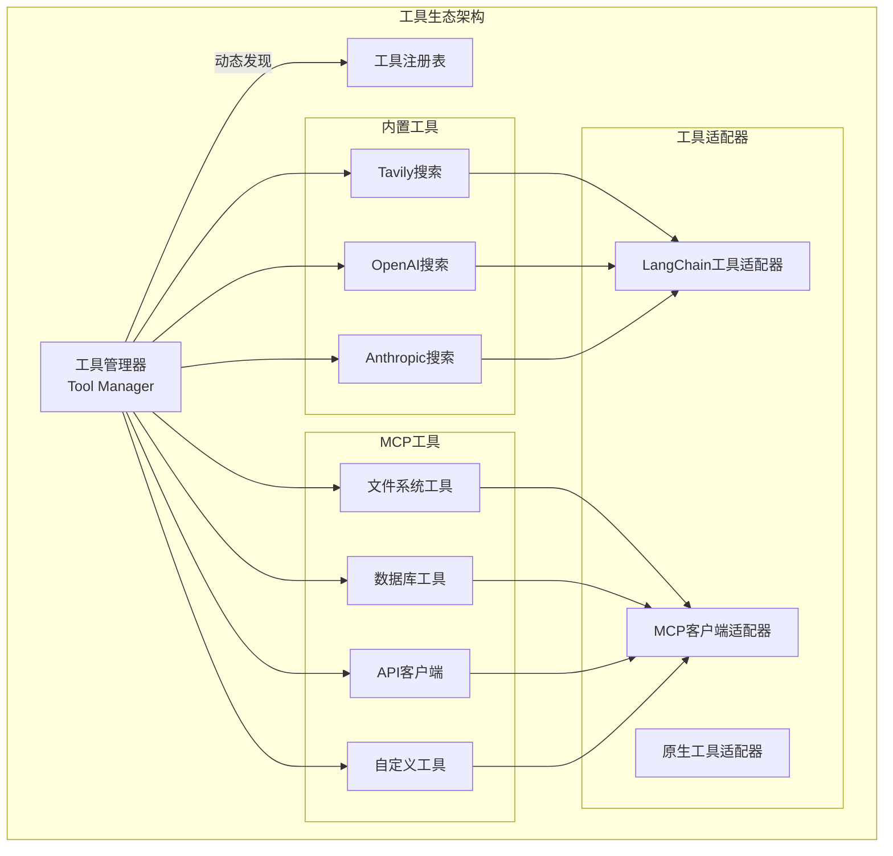

# Open Deep Research 工具集成与MCP深度分析

## 🎯 工具生态系统架构

Open Deep Research构建了一个**插件化的工具生态系统**，支持多种搜索API和MCP（Model Context Protocol）服务器的无缝集成。这种设计体现了现代AI应用中**工具抽象**和**可扩展性**的重要理念。



## 🔧 核心工具系统设计

### 1. 统一工具接口

Open Deep Research通过LangChain的工具框架实现了**统一的工具接口**，使得不同类型的工具可以无缝集成。

#### 1.1 工具定义规范

```python
from langchain_core.tools import BaseTool, tool, StructuredTool
from typing import Annotated, List, Literal
from langchain_core.runnables import RunnableConfig

# 装饰器风格的工具定义
@tool(description=TAVILY_SEARCH_DESCRIPTION)
async def tavily_search(
    queries: List[str],
    max_results: Annotated[int, InjectedToolArg] = 5,
    topic: Annotated[Literal["general", "news", "finance"], InjectedToolArg] = "general",
    config: RunnableConfig = None
) -> str:
    """
    从Tavily搜索API获取结果的统一接口
    
    Args:
        queries: 搜索查询列表，可以传入多个查询
        max_results: 返回结果的最大数量
        topic: 结果过滤主题
    
    Returns:
        str: 格式化的搜索结果字符串
    """
    # 异步搜索执行
    search_results = await tavily_search_async(
        queries, max_results=max_results, topic=topic, 
        include_raw_content=True, config=config
    )
    
    # 结果处理和摘要生成
    return await process_search_results(search_results, config)
```

**工具接口设计要点**:
1. **类型安全**: 使用 `Annotated` 和 `InjectedToolArg` 确保参数类型
2. **异步支持**: 全面的异步API设计
3. **配置传递**: 运行时配置在工具链中的传递
4. **文档化**: 详细的参数和返回值描述

#### 1.2 工具发现与注册

```python
async def get_all_tools(config: RunnableConfig) -> List[BaseTool]:
    """动态发现和注册所有可用工具"""
    configurable = Configuration.from_runnable_config(config)
    tools = []
    
    # 1. 基础搜索工具注册
    search_tools = await register_search_tools(configurable.search_api)
    tools.extend(search_tools)
    
    # 2. MCP工具动态发现
    mcp_tools = await discover_mcp_tools(configurable.mcp_config, config)
    tools.extend(mcp_tools)
    
    # 3. 自定义工具注册
    custom_tools = await register_custom_tools(config)
    tools.extend(custom_tools)
    
    return tools

async def register_search_tools(search_api: SearchAPI) -> List[BaseTool]:
    """根据配置注册搜索工具"""
    tools = []
    
    if search_api == SearchAPI.TAVILY:
        tools.append(tavily_search)
    elif search_api == SearchAPI.OPENAI:
        # OpenAI原生搜索通过模型内置功能实现
        pass  
    elif search_api == SearchAPI.ANTHROPIC:
        # Anthropic原生搜索通过模型内置功能实现
        pass
    elif search_api == SearchAPI.NONE:
        # 不使用搜索工具
        pass
    
    return tools
```

**工具发现策略**:
- **配置驱动**: 根据配置动态启用/禁用工具
- **延迟加载**: 只在需要时加载工具，提高启动性能
- **错误隔离**: 单个工具加载失败不影响其他工具

### 2. 搜索工具深度集成

#### 2.1 Tavily搜索的完整实现

```python
async def tavily_search_async(
    search_queries: List[str], 
    max_results: int = 5, 
    topic: Literal["general", "news", "finance"] = "general",
    include_raw_content: bool = True, 
    config: RunnableConfig = None
) -> List[dict]:
    """Tavily异步搜索的核心实现"""
    
    tavily_async_client = AsyncTavilyClient(api_key=get_tavily_api_key(config))
    search_tasks = []
    
    # 并行搜索任务构建
    for query in search_queries:
        search_tasks.append(
            tavily_async_client.search(
                query=query,
                search_depth="advanced",
                topic=topic,
                max_results=max_results,
                include_raw_content=include_raw_content,
                include_answer=True
            )
        )
    
    # 并行执行所有搜索
    search_results = await asyncio.gather(*search_tasks, return_exceptions=True)
    
    # 错误处理和结果清理
    valid_results = []
    for query, result in zip(search_queries, search_results):
        if isinstance(result, Exception):
            print(f"搜索失败 '{query}': {result}")
            continue
        
        # 添加查询上下文
        result['query'] = query
        valid_results.append(result)
    
    return valid_results
```

#### 2.2 智能结果处理

```python
async def process_search_results(search_results: List[dict], config: RunnableConfig) -> str:
    """智能处理搜索结果，包括去重、摘要和格式化"""
    
    # 1. 结果去重
    unique_results = {}
    for response in search_results:
        for result in response.get('results', []):
            url = result.get('url')
            if url and url not in unique_results:
                unique_results[url] = {**result, "query": response['query']}
    
    if not unique_results:
        return "未找到有效的搜索结果。请尝试不同的搜索查询或使用其他搜索API。"
    
    # 2. 内容摘要生成
    configurable = Configuration.from_runnable_config(config)
    summarization_model = init_chat_model(
        model=configurable.summarization_model,
        max_tokens=configurable.summarization_model_max_tokens,
        api_key=get_api_key_for_model(configurable.summarization_model, config),
    ).with_structured_output(Summary).with_retry(
        stop_after_attempt=configurable.max_structured_output_retries
    )
    
    # 3. 并行摘要处理
    max_char_limit = 50_000  # Token限制转换为字符限制
    summarization_tasks = []
    
    for result in unique_results.values():
        raw_content = result.get("raw_content", "")
        if raw_content:
            # 内容截断以控制Token使用
            truncated_content = raw_content[:max_char_limit]
            task = summarize_webpage(summarization_model, truncated_content)
        else:
            task = asyncio.create_task(asyncio.sleep(0, result=None))  # 空操作
        
        summarization_tasks.append(task)
    
    summaries = await asyncio.gather(*summarization_tasks)
    
    # 4. 结果格式化
    formatted_output = "搜索结果:\n\n"
    
    for i, ((url, result), summary) in enumerate(zip(unique_results.items(), summaries), 1):
        formatted_output += f"\n--- 来源 {i}: {result['title']} ---\n"
        formatted_output += f"URL: {url}\n\n"
        
        # 使用摘要或原始内容
        content = summary.summary if summary else result.get('content', '无内容')
        formatted_output += f"摘要:\n{content}\n\n"
        formatted_output += "-" * 80 + "\n"
    
    return formatted_output
```

**结果处理优化**:
1. **去重策略**: 基于URL的智能去重
2. **并行摘要**: 使用专门的摘要模型并行处理
3. **Token控制**: 内容截断避免超出模型限制
4. **格式优化**: 结构化的结果展示

#### 2.3 网页摘要生成

```python
async def summarize_webpage(summarization_model, raw_content: str) -> Summary:
    """使用专门模型生成网页内容摘要"""
    
    try:
        summary_prompt = summarize_webpage_prompt.format(content=raw_content)
        response = await summarization_model.ainvoke([
            HumanMessage(content=summary_prompt)
        ])
        return response
    except Exception as e:
        print(f"摘要生成失败: {e}")
        # 返回截断的原始内容作为fallback
        return Summary(
            summary=raw_content[:500] + "..." if len(raw_content) > 500 else raw_content,
            key_excerpts=""
        )
```

## 🔌 MCP (Model Context Protocol) 深度集成

### 1. MCP协议概述

MCP是一个**标准化协议**，用于连接AI模型和外部工具/数据源。Open Deep Research通过MCP支持实现了高度的可扩展性。

#### 1.1 MCP配置管理

```python
class MCPConfig(BaseModel):
    """MCP服务器配置模型"""
    url: Optional[str] = Field(
        default=None,
        description="MCP服务器的URL或命令路径"
    )
    tools: Optional[List[str]] = Field(
        default=None,
        description="要启用的工具列表，None表示启用所有工具"
    )
    auth_required: Optional[bool] = Field(
        default=False,
        description="是否需要认证"
    )

class Configuration(BaseModel):
    # ... 其他配置字段 ...
    
    mcp_config: Optional[MCPConfig] = Field(
        default=None,
        metadata={
            "x_oap_ui_config": {
                "type": "mcp",
                "description": "MCP服务器配置"
            }
        }
    )
    mcp_prompt: Optional[str] = Field(
        default=None,
        metadata={
            "x_oap_ui_config": {
                "type": "text",
                "description": "关于可用MCP工具的额外指令"
            }
        }
    )
```

#### 1.2 MCP客户端管理

```python
from langchain_mcp_adapters.client import MultiServerMCPClient
from langgraph.config import get_store
from mcp import McpError

async def discover_mcp_tools(mcp_config: Optional[MCPConfig], config: RunnableConfig) -> List[BaseTool]:
    """发现和集成MCP工具"""
    if not mcp_config or not mcp_config.url:
        return []
    
    tools = []
    
    try:
        # 1. 获取或创建MCP客户端
        store = get_store(config)
        namespace = ["mcp_tools"]
        existing_client = await store.aget(namespace, "mcp_client")
        
        if existing_client is None:
            # 创建新的MCP客户端
            mcp_client = MultiServerMCPClient()
            
            # 添加MCP服务器
            await mcp_client.add_server(
                server_id="mcp_server",
                server_params={
                    "command": "python",
                    "args": [mcp_config.url]
                }
            )
            
            # 缓存客户端实例
            await store.aput(namespace, "mcp_client", mcp_client)
            print(f"✅ MCP客户端已创建并连接到: {mcp_config.url}")
        else:
            mcp_client = existing_client.value
            print(f"♻️ 复用现有MCP客户端")
        
        # 2. 获取可用工具
        available_tools = mcp_client.get_available_tools(server_id="mcp_server")
        print(f"📋 发现 {len(available_tools)} 个MCP工具")
        
        # 3. 工具过滤
        if mcp_config.tools:
            # 只启用指定的工具
            filtered_tools = [
                tool for tool in available_tools 
                if tool.name in mcp_config.tools
            ]
            print(f"🔍 过滤后启用 {len(filtered_tools)} 个工具: {[t.name for t in filtered_tools]}")
            tools.extend(filtered_tools)
        else:
            # 启用所有工具
            print(f"🚀 启用所有 {len(available_tools)} 个MCP工具")
            tools.extend(available_tools)
        
    except McpError as e:
        print(f"❌ MCP连接错误: {e}")
    except Exception as e:
        print(f"❌ MCP工具发现失败: {e}")
    
    return tools
```

**MCP集成特点**:
1. **连接管理**: 使用store缓存连接，避免重复建立
2. **工具过滤**: 支持选择性启用特定工具
3. **错误隔离**: MCP连接失败不影响其他功能
4. **状态持久化**: 客户端实例的持久化管理

### 2. MCP工具的动态加载

#### 2.1 工具适配器

```python
class MCPToolAdapter:
    """MCP工具适配器，将MCP工具转换为LangChain工具"""
    
    def __init__(self, mcp_client: MultiServerMCPClient, server_id: str):
        self.mcp_client = mcp_client
        self.server_id = server_id
    
    def adapt_tool(self, mcp_tool) -> BaseTool:
        """将MCP工具适配为LangChain工具"""
        
        class AdaptedMCPTool(BaseTool):
            name = mcp_tool.name
            description = mcp_tool.description
            
            async def _arun(self, **kwargs) -> str:
                try:
                    result = await self.mcp_client.call_tool(
                        server_id=self.server_id,
                        tool_name=mcp_tool.name,
                        arguments=kwargs
                    )
                    return self._format_result(result)
                except Exception as e:
                    return f"MCP工具执行错误: {str(e)}"
            
            def _format_result(self, result) -> str:
                """格式化MCP工具返回结果"""
                if isinstance(result, dict):
                    return json.dumps(result, ensure_ascii=False, indent=2)
                elif isinstance(result, (list, tuple)):
                    return "\n".join(str(item) for item in result)
                else:
                    return str(result)
        
        return AdaptedMCPTool()
```

#### 2.2 工具生命周期管理

```python
class MCPToolManager:
    """MCP工具生命周期管理器"""
    
    def __init__(self):
        self.active_clients = {}
        self.tool_registry = {}
    
    async def register_mcp_server(self, server_id: str, server_config: dict) -> bool:
        """注册MCP服务器"""
        try:
            client = MultiServerMCPClient()
            await client.add_server(server_id=server_id, server_params=server_config)
            
            self.active_clients[server_id] = client
            await self._discover_tools(server_id)
            
            return True
        except Exception as e:
            print(f"MCP服务器注册失败 {server_id}: {e}")
            return False
    
    async def _discover_tools(self, server_id: str):
        """发现服务器上的工具"""
        client = self.active_clients[server_id]
        tools = client.get_available_tools(server_id=server_id)
        
        for tool in tools:
            tool_key = f"{server_id}::{tool.name}"
            self.tool_registry[tool_key] = {
                "tool": tool,
                "server_id": server_id,
                "client": client
            }
    
    async def get_tool_by_name(self, tool_name: str) -> Optional[BaseTool]:
        """根据名称获取工具"""
        for tool_key, tool_info in self.tool_registry.items():
            if tool_info["tool"].name == tool_name:
                adapter = MCPToolAdapter(tool_info["client"], tool_info["server_id"])
                return adapter.adapt_tool(tool_info["tool"])
        return None
    
    async def cleanup(self):
        """清理资源"""
        for client in self.active_clients.values():
            await client.close()
        self.active_clients.clear()
        self.tool_registry.clear()
```

## 🔒 工具安全与权限管理

### 1. 工具执行安全

```python
async def execute_tool_safely(tool: BaseTool, args: dict, config: RunnableConfig) -> str:
    """安全执行工具调用"""
    try:
        # 1. 参数验证
        validated_args = validate_tool_arguments(tool, args)
        
        # 2. 权限检查
        if not check_tool_permissions(tool.name, config):
            return f"权限拒绝: 无权限使用工具 {tool.name}"
        
        # 3. 资源限制
        with resource_limiter(timeout=30, memory_limit="100MB"):
            result = await tool.ainvoke(validated_args, config)
        
        # 4. 结果过滤
        filtered_result = filter_sensitive_content(result)
        
        return filtered_result
        
    except TimeoutError:
        return f"工具执行超时: {tool.name}"
    except MemoryError:
        return f"工具执行内存超限: {tool.name}"
    except ValidationError as e:
        return f"参数验证失败: {e}"
    except Exception as e:
        print(f"工具执行异常 {tool.name}: {e}")
        return f"工具执行错误: {str(e)}"

def validate_tool_arguments(tool: BaseTool, args: dict) -> dict:
    """验证工具参数"""
    # 基于工具schema验证参数
    if hasattr(tool, 'args_schema') and tool.args_schema:
        return tool.args_schema(**args).dict()
    return args

def check_tool_permissions(tool_name: str, config: RunnableConfig) -> bool:
    """检查工具使用权限"""
    # 实现基于配置的权限检查
    configurable = Configuration.from_runnable_config(config)
    
    # 示例：基于工具名称的简单权限控制
    restricted_tools = ["file_delete", "system_command"]
    if tool_name in restricted_tools:
        return configurable.allow_dangerous_tools  # 假设的配置选项
    
    return True

def filter_sensitive_content(content: str) -> str:
    """过滤敏感内容"""
    import re
    
    # 过滤潜在的敏感信息
    patterns = [
        r'\b[A-Za-z0-9._%+-]+@[A-Za-z0-9.-]+\.[A-Z|a-z]{2,}\b',  # 邮箱
        r'\b\d{4}[\s-]?\d{4}[\s-]?\d{4}[\s-]?\d{4}\b',  # 信用卡号
        r'\b\d{3}-\d{2}-\d{4}\b',  # SSN格式
    ]
    
    filtered_content = content
    for pattern in patterns:
        filtered_content = re.sub(pattern, '[REDACTED]', filtered_content)
    
    return filtered_content
```

### 2. 资源控制

```python
import asyncio
from contextlib import asynccontextmanager
import resource
import psutil
import os

@asynccontextmanager
async def resource_limiter(timeout: int = 30, memory_limit: str = "100MB"):
    """资源限制上下文管理器"""
    
    # 内存限制转换
    memory_bytes = parse_memory_limit(memory_limit)
    
    # 设置资源限制
    old_limits = {}
    try:
        # CPU时间限制
        old_limits['cpu'] = resource.getrlimit(resource.RLIMIT_CPU)
        resource.setrlimit(resource.RLIMIT_CPU, (timeout, timeout + 5))
        
        # 内存限制（如果支持）
        if hasattr(resource, 'RLIMIT_AS'):
            old_limits['memory'] = resource.getrlimit(resource.RLIMIT_AS)
            resource.setrlimit(resource.RLIMIT_AS, (memory_bytes, memory_bytes))
        
        # 启动内存监控
        memory_monitor = asyncio.create_task(monitor_memory_usage(memory_bytes))
        
        yield
        
    finally:
        # 取消监控
        memory_monitor.cancel()
        
        # 恢复资源限制
        for limit_type, old_limit in old_limits.items():
            if limit_type == 'cpu':
                resource.setrlimit(resource.RLIMIT_CPU, old_limit)
            elif limit_type == 'memory' and hasattr(resource, 'RLIMIT_AS'):
                resource.setrlimit(resource.RLIMIT_AS, old_limit)

async def monitor_memory_usage(limit_bytes: int):
    """监控内存使用"""
    process = psutil.Process(os.getpid())
    
    while True:
        try:
            memory_info = process.memory_info()
            if memory_info.rss > limit_bytes:
                raise MemoryError(f"内存使用超限: {memory_info.rss} > {limit_bytes}")
            
            await asyncio.sleep(0.1)  # 每100ms检查一次
        except asyncio.CancelledError:
            break

def parse_memory_limit(limit_str: str) -> int:
    """解析内存限制字符串"""
    import re
    
    match = re.match(r'(\d+)\s*(KB|MB|GB)?', limit_str.upper())
    if not match:
        raise ValueError(f"无效的内存限制格式: {limit_str}")
    
    value, unit = match.groups()
    value = int(value)
    
    multipliers = {'KB': 1024, 'MB': 1024**2, 'GB': 1024**3}
    return value * multipliers.get(unit, 1)
```

## 📊 工具性能监控

### 1. 工具使用统计

```python
class ToolMetrics:
    """工具使用指标收集器"""
    
    def __init__(self):
        self.tool_usage = defaultdict(int)
        self.tool_latency = defaultdict(list)
        self.tool_errors = defaultdict(int)
        self.tool_success_rate = defaultdict(float)
    
    async def record_tool_call(self, tool_name: str, start_time: float, end_time: float, success: bool):
        """记录工具调用指标"""
        self.tool_usage[tool_name] += 1
        
        latency = end_time - start_time
        self.tool_latency[tool_name].append(latency)
        
        if not success:
            self.tool_errors[tool_name] += 1
        
        # 更新成功率
        total_calls = self.tool_usage[tool_name]
        error_calls = self.tool_errors[tool_name]
        self.tool_success_rate[tool_name] = (total_calls - error_calls) / total_calls
    
    def get_tool_statistics(self) -> dict:
        """获取工具使用统计"""
        stats = {}
        
        for tool_name in self.tool_usage:
            latencies = self.tool_latency[tool_name]
            stats[tool_name] = {
                "usage_count": self.tool_usage[tool_name],
                "error_count": self.tool_errors[tool_name],
                "success_rate": self.tool_success_rate[tool_name],
                "avg_latency": sum(latencies) / len(latencies) if latencies else 0,
                "max_latency": max(latencies) if latencies else 0,
                "min_latency": min(latencies) if latencies else 0
            }
        
        return stats

# 装饰器实现工具调用监控
def monitor_tool_execution(metrics: ToolMetrics):
    def decorator(func):
        async def wrapper(*args, **kwargs):
            tool_name = kwargs.get('tool_name', func.__name__)
            start_time = time.time()
            success = True
            
            try:
                result = await func(*args, **kwargs)
                return result
            except Exception as e:
                success = False
                raise
            finally:
                end_time = time.time()
                await metrics.record_tool_call(tool_name, start_time, end_time, success)
        
        return wrapper
    return decorator
```

### 2. 工具性能优化

```python
class ToolPerformanceOptimizer:
    """工具性能优化器"""
    
    def __init__(self):
        self.tool_cache = {}
        self.cache_ttl = 300  # 5分钟缓存
    
    async def cached_tool_call(self, tool: BaseTool, args: dict, config: RunnableConfig) -> str:
        """带缓存的工具调用"""
        cache_key = self._generate_cache_key(tool.name, args)
        
        # 检查缓存
        if cache_key in self.tool_cache:
            cached_result, timestamp = self.tool_cache[cache_key]
            if time.time() - timestamp < self.cache_ttl:
                return f"[CACHED] {cached_result}"
        
        # 执行工具调用
        result = await execute_tool_safely(tool, args, config)
        
        # 更新缓存
        self.tool_cache[cache_key] = (result, time.time())
        
        return result
    
    def _generate_cache_key(self, tool_name: str, args: dict) -> str:
        """生成缓存键"""
        import hashlib
        
        # 排序参数以确保一致性
        sorted_args = json.dumps(args, sort_keys=True)
        cache_string = f"{tool_name}:{sorted_args}"
        
        return hashlib.md5(cache_string.encode()).hexdigest()
    
    def clear_expired_cache(self):
        """清理过期缓存"""
        current_time = time.time()
        expired_keys = [
            key for key, (_, timestamp) in self.tool_cache.items()
            if current_time - timestamp > self.cache_ttl
        ]
        
        for key in expired_keys:
            del self.tool_cache[key]
```

## 🎯 面试要点总结

### 工具生态系统设计

1. **统一接口**: LangChain工具框架的深度应用
2. **插件化架构**: 工具的动态发现和注册机制
3. **协议集成**: MCP协议的深度集成和适配
4. **配置驱动**: 通过配置控制工具的启用和行为

### 系统架构能力

1. **抽象设计**: 工具接口的统一抽象
2. **扩展性**: 新工具的无缝集成机制
3. **性能优化**: 并行执行、缓存、资源控制
4. **安全考虑**: 权限控制、资源限制、内容过滤

### 技术深度展示

1. **异步编程**: 高效的并发工具调用
2. **错误处理**: 多层次的容错机制
3. **资源管理**: 内存和CPU的动态监控
4. **性能监控**: 完整的指标收集和分析

### 工程实践

1. **协议理解**: MCP协议的深度理解和应用
2. **适配器模式**: 不同工具类型的统一适配
3. **生命周期管理**: 工具连接的创建、缓存和清理
4. **监控调试**: 工具使用的可观测性

---

Open Deep Research的工具集成系统体现了现代AI应用中工具生态的最佳实践，通过标准化的接口和协议实现了高度的可扩展性和互操作性。 