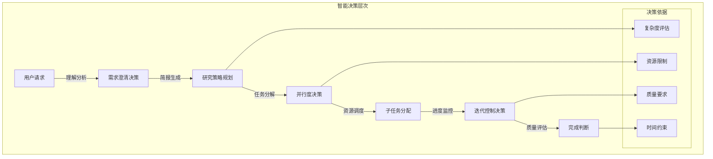

# Open Deep Research 研究策略与决策机制深度分析

## 🎯 智能决策系统概览

Open Deep Research的核心创新在于其**智能研究策略决策系统**。这个系统不依赖硬编码的规则，而是通过**LLM驱动的智能推理**来动态确定最优的研究策略，体现了现代AI系统中**认知智能**和**决策自动化**的前沿应用。



## 🧠 监督者决策机制深度分析

### 1. 研究策略规划的认知模型

监督者代理实现了一个**认知决策模型**，能够理解研究需求并制定相应策略。

#### 1.1 决策提示词工程

```python
# 核心决策提示词（从实际代码推断）
lead_researcher_prompt = """
你是一个研究项目的首席研究员，具备以下能力：

## 核心职责
1. **需求分析**: 深度理解研究简报，识别关键研究维度
2. **策略规划**: 基于复杂度和资源制定最优研究策略
3. **任务分解**: 将复杂研究分解为可并行的独立子任务
4. **质量控制**: 评估研究进展，决定是否需要深入研究

## 决策工具
- `ConductResearch`: 启动特定主题的深度研究
- `ResearchComplete`: 确认研究已达到要求标准

## 决策原则
1. **并行优化**: 识别可并行研究的独立主题
2. **深度平衡**: 在广度和深度之间找到最优平衡点
3. **资源约束**: 考虑并发限制 ({max_concurrent_research_units} 个单元)
4. **质量导向**: 确保每个研究维度都有充分的信息支撑

## 研究策略类型
- **比较研究**: A vs B vs C 的对比分析
- **调查研究**: 全面的信息收集和整理
- **验证研究**: 特定假设或观点的深度验证
- **趋势研究**: 发展历程和未来趋势分析

当前日期: {date}
当前最大并发研究单元数: {max_concurrent_research_units}

请基于研究简报制定最优的研究策略。
"""
```

**提示词设计亮点**:
1. **角色定位**: 明确的首席研究员身份认知
2. **能力框架**: 清晰的决策能力和工具权限
3. **约束感知**: 资源限制和质量要求的平衡
4. **策略类型**: 不同研究场景的策略模板

#### 1.2 智能任务分解算法

```python
class ResearchTaskDecomposer:
    """智能研究任务分解器"""
    
    def __init__(self, llm_model):
        self.llm_model = llm_model
        self.decomposition_strategies = {
            "comparison": self._comparison_decomposition,
            "investigation": self._investigation_decomposition,
            "validation": self._validation_decomposition,
            "trend_analysis": self._trend_decomposition
        }
    
    async def decompose_research_brief(self, research_brief: str, max_parallel: int) -> List[str]:
        """智能分解研究简报为可并行的子任务"""
        
        # 1. 研究类型识别
        research_type = await self._identify_research_type(research_brief)
        
        # 2. 复杂度评估
        complexity_score = await self._assess_complexity(research_brief)
        
        # 3. 分解策略选择
        decomposer = self.decomposition_strategies.get(research_type, self._default_decomposition)
        
        # 4. 任务分解执行
        subtasks = await decomposer(research_brief, complexity_score, max_parallel)
        
        return subtasks
    
    async def _identify_research_type(self, research_brief: str) -> str:
        """识别研究类型"""
        classification_prompt = f"""
        分析以下研究简报，确定其主要类型：
        
        研究简报: {research_brief}
        
        类型选项:
        - comparison: 比较分析多个对象
        - investigation: 全面调查某个主题
        - validation: 验证特定观点或假设
        - trend_analysis: 分析发展趋势
        
        返回类型: """
        
        response = await self.llm_model.ainvoke([HumanMessage(content=classification_prompt)])
        return response.content.strip().lower()
    
    async def _comparison_decomposition(self, research_brief: str, complexity: float, max_parallel: int) -> List[str]:
        """比较研究的分解策略"""
        comparison_prompt = f"""
        将以下比较研究分解为独立的子任务：
        
        研究简报: {research_brief}
        最大并行数: {max_parallel}
        
        分解原则:
        1. 每个比较对象独立研究
        2. 共同维度的深度分析
        3. 确保比较的公平性和全面性
        
        请返回{max_parallel}个独立的研究子任务:
        """
        
        response = await self.llm_model.ainvoke([HumanMessage(content=comparison_prompt)])
        return self._parse_subtasks(response.content)
    
    async def _assess_complexity(self, research_brief: str) -> float:
        """评估研究复杂度 (0-1)"""
        complexity_prompt = f"""
        评估以下研究任务的复杂度，返回0-1之间的数值：
        
        研究简报: {research_brief}
        
        评估维度:
        - 主题范围的广度
        - 需要的专业深度
        - 信息源的多样性
        - 分析的复杂程度
        
        复杂度分数(0-1): """
        
        response = await self.llm_model.ainvoke([HumanMessage(content=complexity_prompt)])
        try:
            return float(response.content.strip())
        except:
            return 0.5  # 默认中等复杂度
```

### 2. 动态策略调整机制

#### 2.1 自适应深度控制

```python
class AdaptiveDepthController:
    """自适应深度控制器"""
    
    def __init__(self):
        self.depth_thresholds = {
            "shallow": 0.3,    # 浅层研究阈值
            "medium": 0.6,     # 中等深度阈值
            "deep": 1.0        # 深度研究阈值
        }
    
    async def determine_research_depth(self, research_brief: str, initial_results: List[str]) -> str:
        """基于初始结果动态确定研究深度"""
        
        # 1. 分析初始结果的信息密度
        info_density = await self._calculate_information_density(initial_results)
        
        # 2. 评估研究简报的复杂度需求
        complexity_requirement = await self._assess_complexity_requirement(research_brief)
        
        # 3. 计算信息覆盖度
        coverage_score = await self._evaluate_coverage(research_brief, initial_results)
        
        # 4. 综合决策
        depth_score = (info_density * 0.3 + complexity_requirement * 0.4 + coverage_score * 0.3)
        
        if depth_score < self.depth_thresholds["shallow"]:
            return "continue_deep_research"
        elif depth_score < self.depth_thresholds["medium"]:
            return "moderate_expansion"
        else:
            return "research_complete"
    
    async def _calculate_information_density(self, results: List[str]) -> float:
        """计算信息密度"""
        if not results:
            return 0.0
        
        total_chars = sum(len(result) for result in results)
        unique_info_ratio = await self._estimate_unique_information_ratio(results)
        
        # 归一化信息密度
        density = min(1.0, (total_chars * unique_info_ratio) / 10000)
        return density
    
    async def _estimate_unique_information_ratio(self, results: List[str]) -> float:
        """估算独特信息比例"""
        # 简化实现：基于去重后的内容比例
        all_content = " ".join(results)
        words = all_content.split()
        unique_words = set(words)
        
        if not words:
            return 0.0
        
        return len(unique_words) / len(words)
```

#### 2.2 迭代决策模型

```python
class IterativeDecisionModel:
    """迭代决策模型"""
    
    def __init__(self, max_iterations: int = 3):
        self.max_iterations = max_iterations
        self.decision_history = []
    
    async def make_iteration_decision(self, 
                                    current_state: dict,
                                    research_progress: float,
                                    resource_usage: float) -> dict:
        """迭代决策：是否继续研究"""
        
        decision_context = {
            "iteration": len(self.decision_history) + 1,
            "max_iterations": self.max_iterations,
            "research_progress": research_progress,
            "resource_usage": resource_usage,
            "previous_decisions": self.decision_history
        }
        
        # 1. 终止条件检查
        if self._should_terminate(decision_context):
            return {
                "action": "terminate",
                "reason": self._get_termination_reason(decision_context)
            }
        
        # 2. 继续策略决策
        continue_strategy = await self._determine_continue_strategy(decision_context)
        
        decision = {
            "action": "continue",
            "strategy": continue_strategy,
            "context": decision_context
        }
        
        self.decision_history.append(decision)
        return decision
    
    def _should_terminate(self, context: dict) -> bool:
        """判断是否应该终止研究"""
        
        # 达到最大迭代次数
        if context["iteration"] >= self.max_iterations:
            return True
        
        # 研究进展充分且资源使用合理
        if context["research_progress"] > 0.8 and context["resource_usage"] < 0.9:
            return True
        
        # 连续两次迭代进展微小
        if len(self.decision_history) >= 2:
            recent_progress = [d["context"]["research_progress"] for d in self.decision_history[-2:]]
            if recent_progress[-1] - recent_progress[-2] < 0.1:
                return True
        
        return False
    
    async def _determine_continue_strategy(self, context: dict) -> str:
        """确定继续研究的策略"""
        progress = context["research_progress"]
        resource = context["resource_usage"]
        
        if progress < 0.4:
            return "expand_breadth"  # 扩大研究范围
        elif progress < 0.7:
            return "deepen_analysis"  # 深化分析
        else:
            return "fill_gaps"  # 填补信息空白
```

## 🔄 实时决策反馈循环

### 1. 决策质量评估

```python
class DecisionQualityEvaluator:
    """决策质量评估器"""
    
    def __init__(self, llm_model):
        self.llm_model = llm_model
        self.quality_metrics = {}
    
    async def evaluate_research_decision(self, 
                                       research_brief: str,
                                       decision: dict,
                                       outcomes: List[str]) -> float:
        """评估研究决策的质量"""
        
        evaluation_prompt = f"""
        评估以下研究决策的质量：
        
        原始研究简报: {research_brief}
        
        决策内容: {decision}
        
        实际结果: {outcomes}
        
        评估维度:
        1. 相关性(0-1): 结果与研究目标的匹配度
        2. 完整性(0-1): 信息覆盖的全面程度
        3. 效率性(0-1): 资源使用的合理性
        4. 创新性(0-1): 发现新见解的能力
        
        请分别给出四个维度的分数，并计算综合质量分数(0-1):
        """
        
        response = await self.llm_model.ainvoke([HumanMessage(content=evaluation_prompt)])
        quality_score = self._parse_quality_score(response.content)
        
        # 记录评估结果
        self.quality_metrics[len(self.quality_metrics)] = {
            "decision": decision,
            "quality_score": quality_score,
            "timestamp": time.time()
        }
        
        return quality_score
    
    def _parse_quality_score(self, evaluation_text: str) -> float:
        """解析质量评估分数"""
        import re
        
        # 提取综合分数
        score_pattern = r'综合质量分数[：:]\s*([0-9]*\.?[0-9]+)'
        match = re.search(score_pattern, evaluation_text)
        
        if match:
            return float(match.group(1))
        
        # 如果没有找到综合分数，尝试提取各维度分数并计算平均值
        dimension_pattern = r'([0-9]*\.?[0-9]+)'
        scores = re.findall(dimension_pattern, evaluation_text)
        
        if scores:
            numeric_scores = [float(s) for s in scores if 0 <= float(s) <= 1]
            return sum(numeric_scores) / len(numeric_scores) if numeric_scores else 0.5
        
        return 0.5  # 默认中等质量
```

### 2. 自适应学习机制

```python
class AdaptiveLearningSystem:
    """自适应学习系统"""
    
    def __init__(self):
        self.decision_patterns = {}
        self.success_indicators = {}
        self.learning_rate = 0.1
    
    def record_decision_outcome(self, 
                              decision_context: dict,
                              decision: dict,
                              outcome_quality: float):
        """记录决策结果，用于学习"""
        
        decision_type = self._classify_decision_type(decision_context, decision)
        
        if decision_type not in self.decision_patterns:
            self.decision_patterns[decision_type] = {
                "count": 0,
                "quality_sum": 0,
                "avg_quality": 0
            }
        
        pattern = self.decision_patterns[decision_type]
        pattern["count"] += 1
        pattern["quality_sum"] += outcome_quality
        pattern["avg_quality"] = pattern["quality_sum"] / pattern["count"]
    
    def suggest_optimal_strategy(self, current_context: dict) -> str:
        """基于历史学习建议最优策略"""
        
        # 找到相似的历史决策上下文
        similar_patterns = self._find_similar_patterns(current_context)
        
        if not similar_patterns:
            return "default_strategy"
        
        # 选择质量最高的策略
        best_pattern = max(similar_patterns, key=lambda x: x["avg_quality"])
        return best_pattern["strategy"]
    
    def _classify_decision_type(self, context: dict, decision: dict) -> str:
        """分类决策类型"""
        complexity = context.get("complexity", 0.5)
        resource_constraint = context.get("resource_usage", 0.5)
        
        if complexity < 0.3:
            return "simple_research"
        elif complexity < 0.7:
            if resource_constraint < 0.5:
                return "medium_complexity_low_resource"
            else:
                return "medium_complexity_high_resource"
        else:
            return "complex_research"
    
    def _find_similar_patterns(self, context: dict) -> List[dict]:
        """找到相似的决策模式"""
        current_type = self._classify_decision_type(context, {})
        
        similar = []
        for pattern_type, pattern_data in self.decision_patterns.items():
            if self._patterns_similar(current_type, pattern_type):
                similar.append({
                    "strategy": pattern_type,
                    "avg_quality": pattern_data["avg_quality"],
                    "confidence": pattern_data["count"] / 10  # 基于样本数的置信度
                })
        
        return similar
```

## 🎯 多维度决策优化

### 1. 资源约束下的决策优化

```python
class ResourceConstrainedOptimizer:
    """资源约束下的决策优化器"""
    
    def __init__(self, max_concurrent: int, token_budget: int, time_limit: int):
        self.max_concurrent = max_concurrent
        self.token_budget = token_budget
        self.time_limit = time_limit
    
    async def optimize_research_allocation(self, 
                                         research_tasks: List[dict],
                                         priority_weights: dict) -> List[dict]:
        """在资源约束下优化研究任务分配"""
        
        # 1. 任务价值评估
        valued_tasks = await self._evaluate_task_values(research_tasks, priority_weights)
        
        # 2. 资源需求估算
        for task in valued_tasks:
            task["estimated_tokens"] = await self._estimate_token_cost(task)
            task["estimated_time"] = await self._estimate_time_cost(task)
        
        # 3. 约束优化求解
        optimal_allocation = self._solve_allocation_problem(valued_tasks)
        
        return optimal_allocation
    
    async def _evaluate_task_values(self, tasks: List[dict], weights: dict) -> List[dict]:
        """评估任务价值"""
        valued_tasks = []
        
        for task in tasks:
            value_score = 0
            
            # 基于优先级权重计算价值
            for factor, weight in weights.items():
                if factor == "relevance":
                    value_score += weight * await self._assess_relevance(task)
                elif factor == "novelty":
                    value_score += weight * await self._assess_novelty(task)
                elif factor == "completeness":
                    value_score += weight * await self._assess_completeness_potential(task)
            
            task["value_score"] = value_score
            valued_tasks.append(task)
        
        return valued_tasks
    
    def _solve_allocation_problem(self, tasks: List[dict]) -> List[dict]:
        """解决资源分配优化问题（简化版背包问题）"""
        
        # 按价值密度排序（价值/资源比）
        for task in tasks:
            resource_cost = task["estimated_tokens"] + task["estimated_time"] * 100
            task["value_density"] = task["value_score"] / max(resource_cost, 1)
        
        tasks.sort(key=lambda x: x["value_density"], reverse=True)
        
        # 贪心选择
        selected_tasks = []
        current_tokens = 0
        current_time = 0
        current_concurrent = 0
        
        for task in tasks:
            if (current_tokens + task["estimated_tokens"] <= self.token_budget and
                current_time + task["estimated_time"] <= self.time_limit and
                current_concurrent < self.max_concurrent):
                
                selected_tasks.append(task)
                current_tokens += task["estimated_tokens"]
                current_time += task["estimated_time"]
                current_concurrent += 1
        
        return selected_tasks
```

### 2. 质量驱动的决策调优

```python
class QualityDrivenOptimizer:
    """质量驱动的决策调优器"""
    
    def __init__(self, quality_threshold: float = 0.8):
        self.quality_threshold = quality_threshold
        self.quality_history = []
    
    async def optimize_for_quality(self, 
                                 current_results: List[str],
                                 research_brief: str,
                                 remaining_resources: dict) -> dict:
        """基于质量要求优化决策"""
        
        # 1. 当前质量评估
        current_quality = await self._assess_current_quality(current_results, research_brief)
        
        # 2. 质量缺口分析
        quality_gaps = await self._identify_quality_gaps(current_results, research_brief)
        
        # 3. 改进策略生成
        if current_quality < self.quality_threshold:
            improvement_strategy = await self._generate_improvement_strategy(
                quality_gaps, remaining_resources
            )
        else:
            improvement_strategy = {"action": "maintain_quality"}
        
        # 4. 记录质量历史
        self.quality_history.append({
            "timestamp": time.time(),
            "quality_score": current_quality,
            "gaps": quality_gaps
        })
        
        return improvement_strategy
    
    async def _identify_quality_gaps(self, results: List[str], brief: str) -> List[dict]:
        """识别质量缺口"""
        gap_analysis_prompt = f"""
        分析以下研究结果的质量缺口：
        
        研究简报: {brief}
        
        当前结果: {results}
        
        请识别以下维度的缺口：
        1. 信息完整性缺口
        2. 分析深度缺口  
        3. 观点平衡性缺口
        4. 证据支撑缺口
        
        为每个缺口提供具体描述和改进建议。
        """
        
        # 这里应该调用LLM分析
        # response = await self.llm_model.ainvoke([HumanMessage(content=gap_analysis_prompt)])
        # return self._parse_quality_gaps(response.content)
        
        # 简化实现
        return [
            {"type": "completeness", "severity": 0.3, "description": "需要更多背景信息"},
            {"type": "depth", "severity": 0.2, "description": "分析深度可以进一步加强"}
        ]
```

## 📊 决策效果量化分析

### 1. 决策效果指标

```python
class DecisionEffectivenessAnalyzer:
    """决策效果分析器"""
    
    def __init__(self):
        self.metrics = {
            "decision_accuracy": [],     # 决策准确率
            "resource_efficiency": [],   # 资源效率
            "quality_achievement": [],   # 质量达成率
            "time_effectiveness": []     # 时间效率
        }
    
    def analyze_decision_effectiveness(self, decisions: List[dict], outcomes: List[dict]) -> dict:
        """分析决策效果"""
        
        effectiveness_report = {}
        
        # 1. 决策准确率分析
        accuracy_scores = []
        for decision, outcome in zip(decisions, outcomes):
            predicted_quality = decision.get("expected_quality", 0.5)
            actual_quality = outcome.get("quality_score", 0.5)
            accuracy = 1 - abs(predicted_quality - actual_quality)
            accuracy_scores.append(accuracy)
        
        effectiveness_report["decision_accuracy"] = {
            "average": sum(accuracy_scores) / len(accuracy_scores),
            "trend": self._calculate_trend(accuracy_scores),
            "improvement_rate": self._calculate_improvement_rate(accuracy_scores)
        }
        
        # 2. 资源效率分析
        resource_efficiency = []
        for decision, outcome in zip(decisions, outcomes):
            planned_resources = decision.get("estimated_resources", 1)
            actual_resources = outcome.get("actual_resources", 1)
            efficiency = planned_resources / max(actual_resources, 0.1)
            resource_efficiency.append(min(efficiency, 2.0))  # 上限为2.0
        
        effectiveness_report["resource_efficiency"] = {
            "average": sum(resource_efficiency) / len(resource_efficiency),
            "variance": self._calculate_variance(resource_efficiency)
        }
        
        return effectiveness_report
    
    def _calculate_trend(self, values: List[float]) -> str:
        """计算趋势"""
        if len(values) < 2:
            return "insufficient_data"
        
        first_half = sum(values[:len(values)//2]) / (len(values)//2)
        second_half = sum(values[len(values)//2:]) / (len(values) - len(values)//2)
        
        if second_half > first_half + 0.1:
            return "improving"
        elif second_half < first_half - 0.1:
            return "declining"
        else:
            return "stable"
```

### 2. 决策模式识别

```python
class DecisionPatternRecognizer:
    """决策模式识别器"""
    
    def __init__(self):
        self.patterns = {}
        self.pattern_effectiveness = {}
    
    def recognize_decision_patterns(self, decision_history: List[dict]) -> dict:
        """识别决策模式"""
        
        patterns_found = {}
        
        # 1. 序列模式识别
        sequence_patterns = self._find_sequence_patterns(decision_history)
        patterns_found["sequences"] = sequence_patterns
        
        # 2. 条件模式识别
        conditional_patterns = self._find_conditional_patterns(decision_history)
        patterns_found["conditionals"] = conditional_patterns
        
        # 3. 周期模式识别
        cyclic_patterns = self._find_cyclic_patterns(decision_history)
        patterns_found["cycles"] = cyclic_patterns
        
        return patterns_found
    
    def _find_sequence_patterns(self, history: List[dict]) -> List[dict]:
        """查找序列模式"""
        sequences = []
        
        # 滑动窗口查找常见序列
        for window_size in [2, 3, 4]:
            for i in range(len(history) - window_size + 1):
                sequence = history[i:i+window_size]
                sequence_key = self._sequence_to_key(sequence)
                
                if sequence_key not in sequences:
                    sequences.append({
                        "pattern": sequence_key,
                        "frequency": self._count_sequence_frequency(history, sequence),
                        "effectiveness": self._evaluate_sequence_effectiveness(sequence)
                    })
        
        return sorted(sequences, key=lambda x: x["frequency"], reverse=True)[:10]
    
    def _sequence_to_key(self, sequence: List[dict]) -> str:
        """将序列转换为模式键"""
        return " -> ".join([
            f"{d.get('type', 'unknown')}({d.get('strategy', 'default')})"
            for d in sequence
        ])
```

## 🎯 面试要点总结

### 核心技术概念

1. **LLM驱动决策**: 如何使用大语言模型进行复杂决策推理
2. **自适应策略**: 基于实时反馈动态调整研究策略
3. **资源优化**: 在约束条件下的最优决策算法
4. **质量控制**: 多维度质量评估和改进机制

### 系统设计能力展示

1. **智能决策架构**: 分层决策系统的设计和实现
2. **反馈循环**: 决策-执行-评估-学习的完整闭环
3. **约束优化**: 多目标约束下的优化问题求解
4. **模式识别**: 决策模式的自动识别和优化

### 技术深度讨论

1. **认知架构**: AI系统的认知决策模型
2. **元学习**: 决策系统的自我学习和改进
3. **多目标优化**: 质量、效率、成本的平衡
4. **不确定性处理**: 面对不完整信息的决策策略

### 实际应用价值

1. **动态调度**: 研究任务的智能调度和分配
2. **质量保证**: 自动化的质量控制和改进
3. **效率优化**: 资源利用率的持续优化
4. **决策透明**: 可解释的决策过程和依据

---

这种智能决策机制体现了现代AI系统从简单执行向智能决策的演进，通过LLM的推理能力实现了真正的认知智能。 