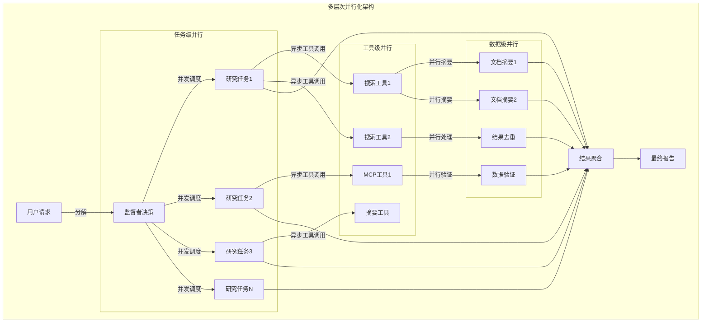

# Open Deep Research 并行化与性能优化深度分析

## 🎯 并行化架构概览

Open Deep Research通过**多层次并行化设计**实现了显著的性能提升。根据 [LangChain博客](https://blog.langchain.com/open-deep-research/) 的数据，3个并行任务的平均响应时间从180秒降至70秒，提升了**2.6倍**的执行效率。这种性能优化体现了现代AI系统中**并发工程**和**资源优化**的核心理念。



## 🚀 核心并行化技术

### 1. 任务级并行 - 监督者调度机制

#### 1.1 异步任务分发

```python
async def supervisor_tools(state: SupervisorState, config: RunnableConfig):
    """监督者并行任务调度的核心实现"""
    configurable = Configuration.from_runnable_config(config)
    most_recent_message = supervisor_messages[-1]
    
    # 1. 提取并发控制的研究任务
    all_conduct_research_calls = [
        tool_call for tool_call in most_recent_message.tool_calls 
        if tool_call["name"] == "ConductResearch"
    ]
    
    # 2. 并发数量控制 - 防止资源过载
    max_concurrent = configurable.max_concurrent_research_units
    conduct_research_calls = all_conduct_research_calls[:max_concurrent]
    overflow_calls = all_conduct_research_calls[max_concurrent:]
    
    # 3. 异步协程构建 - 真正的并行执行
    researcher_system_prompt = research_system_prompt.format(
        mcp_prompt=configurable.mcp_prompt or "", 
        date=get_today_str()
    )
    
    coros = [
        researcher_subgraph.ainvoke({
            "researcher_messages": [
                SystemMessage(content=researcher_system_prompt),
                HumanMessage(content=tool_call["args"]["research_topic"])
            ],
            "research_topic": tool_call["args"]["research_topic"]
        }, config) 
        for tool_call in conduct_research_calls
    ]
    
    # 4. 并行执行和结果收集
    try:
        tool_results = await asyncio.gather(*coros)
    except Exception as e:
        # 并行执行的错误处理
        return handle_parallel_execution_error(e, conduct_research_calls)
    
    # 5. 结果聚合和消息构造
    tool_messages = [
        ToolMessage(
            content=observation.get("compressed_research", "研究合成错误"),
            name=tool_call["name"],
            tool_call_id=tool_call["id"]
        ) for observation, tool_call in zip(tool_results, conduct_research_calls)
    ]
    
    # 6. 溢出任务的错误处理
    for overflow_call in overflow_calls:
        tool_messages.append(ToolMessage(
            content=f"错误：已超过最大并发研究单元数 ({max_concurrent})。请减少并发任务数量。",
            name="ConductResearch",
            tool_call_id=overflow_call["id"]
        ))
    
    return Command(
        goto="supervisor",
        update={
            "supervisor_messages": tool_messages,
            "raw_notes": ["\n".join(["\n".join(obs.get("raw_notes", [])) for obs in tool_results])]
        }
    )
```

**并行调度优化要点**:
1. **资源边界控制**: 通过 `max_concurrent_research_units` 防止系统过载
2. **真正异步执行**: 使用 `asyncio.gather()` 实现真正的并发
3. **独立上下文**: 每个子任务拥有完全独立的消息历史
4. **溢出处理**: 优雅处理超出并发限制的任务

#### 1.2 并发性能分析

```python
class ParallelExecutionAnalyzer:
    """并行执行性能分析器"""
    
    def __init__(self):
        self.execution_metrics = {}
        self.parallel_efficiency = {}
    
    async def analyze_parallel_performance(self, tasks: List[dict], max_concurrent: int) -> dict:
        """分析并行执行性能"""
        
        # 1. 理论性能计算
        total_sequential_time = sum(task.get("estimated_time", 60) for task in tasks)
        theoretical_parallel_time = max(task.get("estimated_time", 60) for task in tasks)
        theoretical_speedup = total_sequential_time / theoretical_parallel_time
        
        # 2. 实际性能测量
        start_time = time.time()
        actual_results = await self._execute_parallel_tasks(tasks, max_concurrent)
        actual_parallel_time = time.time() - start_time
        
        # 3. 效率分析
        actual_speedup = total_sequential_time / actual_parallel_time
        parallel_efficiency = actual_speedup / min(len(tasks), max_concurrent)
        
        # 4. 瓶颈识别
        bottlenecks = await self._identify_bottlenecks(tasks, actual_results)
        
        return {
            "theoretical_speedup": theoretical_speedup,
            "actual_speedup": actual_speedup,
            "parallel_efficiency": parallel_efficiency,
            "bottlenecks": bottlenecks,
            "resource_utilization": await self._calculate_resource_utilization(actual_results)
        }
    
    async def _execute_parallel_tasks(self, tasks: List[dict], max_concurrent: int) -> List[dict]:
        """执行并行任务并收集性能数据"""
        
        # 分批执行，避免过载
        results = []
        for i in range(0, len(tasks), max_concurrent):
            batch = tasks[i:i + max_concurrent]
            
            # 为每个任务添加性能监控
            monitored_coros = [
                self._monitor_task_execution(task) 
                for task in batch
            ]
            
            batch_results = await asyncio.gather(*monitored_coros, return_exceptions=True)
            results.extend(batch_results)
        
        return results
    
    async def _monitor_task_execution(self, task: dict) -> dict:
        """监控单个任务的执行性能"""
        task_start = time.time()
        memory_start = psutil.Process().memory_info().rss
        
        try:
            # 执行任务（这里是模拟）
            await asyncio.sleep(task.get("estimated_time", 1))
            result = {"status": "success", "data": f"Result for {task['id']}"}
        except Exception as e:
            result = {"status": "error", "error": str(e)}
        
        task_end = time.time()
        memory_end = psutil.Process().memory_info().rss
        
        return {
            "task_id": task.get("id"),
            "execution_time": task_end - task_start,
            "memory_delta": memory_end - memory_start,
            "result": result
        }
```

### 2. 工具级并行 - 异步工具调用

#### 2.1 多工具并行执行

```python
async def researcher_tools(state: ResearcherState, config: RunnableConfig):
    """研究者工具的并行调用机制"""
    configurable = Configuration.from_runnable_config(config)
    researcher_messages = state.get("researcher_messages", [])
    most_recent_message = researcher_messages[-1]
    
    # 1. 获取可用工具
    tools = await get_all_tools(config)
    tools_by_name = {
        tool.name if hasattr(tool, "name") else tool.get("name", "web_search"): tool 
        for tool in tools
    }
    
    # 2. 并行工具调用构建
    tool_calls = most_recent_message.tool_calls
    coros = [
        execute_tool_safely(tools_by_name[tool_call["name"]], tool_call["args"], config)
        for tool_call in tool_calls
    ]
    
    # 3. 异步并行执行
    observations = await asyncio.gather(*coros)
    
    # 4. 结果封装
    tool_outputs = [
        ToolMessage(
            content=observation,
            name=tool_call["name"],
            tool_call_id=tool_call["id"]
        ) for observation, tool_call in zip(observations, tool_calls)
    ]
    
    return Command(
        goto="researcher" if should_continue_research(state) else "compress_research",
        update={"researcher_messages": tool_outputs}
    )

async def execute_tool_safely(tool, args, config):
    """安全的异步工具执行"""
    try:
        # 添加超时控制
        result = await asyncio.wait_for(
            tool.ainvoke(args, config),
            timeout=30.0  # 30秒超时
        )
        return result
    except asyncio.TimeoutError:
        return f"工具执行超时: {tool.name}"
    except Exception as e:
        return f"工具执行错误: {str(e)}"
```

#### 2.2 工具调用优化策略

```python
class ToolExecutionOptimizer:
    """工具执行优化器"""
    
    def __init__(self):
        self.tool_performance_cache = {}
        self.connection_pools = {}
    
    async def optimize_tool_calls(self, tool_calls: List[dict], config: RunnableConfig) -> List[dict]:
        """优化工具调用策略"""
        
        # 1. 工具调用分组 - 相同类型的工具可以共享连接
        grouped_calls = self._group_tool_calls(tool_calls)
        
        # 2. 并发度动态调整
        optimized_groups = []
        for tool_type, calls in grouped_calls.items():
            optimal_concurrency = await self._calculate_optimal_concurrency(tool_type, calls)
            optimized_groups.append({
                "tool_type": tool_type,
                "calls": calls,
                "concurrency": optimal_concurrency
            })
        
        # 3. 分组并行执行
        all_results = []
        for group in optimized_groups:
            group_results = await self._execute_tool_group(group, config)
            all_results.extend(group_results)
        
        return all_results
    
    def _group_tool_calls(self, tool_calls: List[dict]) -> dict:
        """按工具类型分组"""
        groups = {}
        for call in tool_calls:
            tool_type = self._classify_tool_type(call["name"])
            if tool_type not in groups:
                groups[tool_type] = []
            groups[tool_type].append(call)
        return groups
    
    async def _calculate_optimal_concurrency(self, tool_type: str, calls: List[dict]) -> int:
        """计算最优并发度"""
        
        # 基于历史性能数据计算
        if tool_type in self.tool_performance_cache:
            perf_data = self.tool_performance_cache[tool_type]
            avg_latency = perf_data["avg_latency"]
            error_rate = perf_data["error_rate"]
            
            # 高延迟工具适合更高并发
            # 高错误率工具适合较低并发
            base_concurrency = min(len(calls), 5)
            latency_factor = min(2.0, avg_latency / 5.0)  # 5秒作为基准
            error_factor = max(0.5, 1.0 - error_rate)
            
            optimal = int(base_concurrency * latency_factor * error_factor)
            return max(1, min(optimal, len(calls)))
        
        # 默认策略
        return min(len(calls), 3)
    
    async def _execute_tool_group(self, group: dict, config: RunnableConfig) -> List[dict]:
        """执行工具组"""
        calls = group["calls"]
        concurrency = group["concurrency"]
        
        results = []
        
        # 分批执行，控制并发数
        for i in range(0, len(calls), concurrency):
            batch = calls[i:i + concurrency]
            
            # 使用连接池优化
            batch_coros = [
                self._execute_with_connection_pool(call, config)
                for call in batch
            ]
            
            batch_results = await asyncio.gather(*batch_coros, return_exceptions=True)
            results.extend(batch_results)
        
        return results
```

### 3. 数据级并行 - 内容处理优化

#### 3.1 并行摘要生成

```python
async def process_search_results(search_results: List[dict], config: RunnableConfig) -> str:
    """并行处理搜索结果的优化实现"""
    
    # 1. 结果去重 - O(n) 时间复杂度
    unique_results = {}
    for response in search_results:
        for result in response.get('results', []):
            url = result.get('url')
            if url and url not in unique_results:
                unique_results[url] = {**result, "query": response['query']}
    
    if not unique_results:
        return "未找到有效的搜索结果。"
    
    # 2. 摘要任务构建 - 并行化准备
    configurable = Configuration.from_runnable_config(config)
    summarization_model = init_chat_model(
        model=configurable.summarization_model,
        max_tokens=configurable.summarization_model_max_tokens,
        api_key=get_api_key_for_model(configurable.summarization_model, config),
    ).with_structured_output(Summary).with_retry(
        stop_after_attempt=configurable.max_structured_output_retries
    )
    
    # 3. 并行摘要任务
    max_char_limit = 50_000
    summarization_tasks = []
    
    for result in unique_results.values():
        raw_content = result.get("raw_content", "")
        if raw_content:
            # 内容预处理 - 减少摘要工作量
            processed_content = preprocess_content(raw_content[:max_char_limit])
            task = summarize_webpage_optimized(summarization_model, processed_content)
        else:
            # 使用异步空操作避免 None 值
            task = create_empty_summary()
        
        summarization_tasks.append(task)
    
    # 4. 批量并行执行 - 控制并发数避免API限制
    batch_size = 5  # 控制并发摘要数量
    all_summaries = []
    
    for i in range(0, len(summarization_tasks), batch_size):
        batch = summarization_tasks[i:i + batch_size]
        batch_summaries = await asyncio.gather(*batch, return_exceptions=True)
        all_summaries.extend(batch_summaries)
    
    # 5. 结果格式化 - 并行友好的实现
    formatted_output = await format_results_parallel(unique_results, all_summaries)
    
    return formatted_output

async def summarize_webpage_optimized(model, content: str) -> Summary:
    """优化的网页摘要生成"""
    try:
        # 智能内容截断 - 保留关键部分
        optimized_content = intelligent_content_truncation(content)
        
        summary_prompt = summarize_webpage_prompt.format(content=optimized_content)
        
        # 异步调用模型
        response = await model.ainvoke([HumanMessage(content=summary_prompt)])
        return response
        
    except Exception as e:
        # 降级策略 - 使用提取式摘要
        return Summary(
            summary=extractive_summary(content, max_length=300),
            key_excerpts=extract_key_phrases(content)
        )

def intelligent_content_truncation(content: str, max_length: int = 4000) -> str:
    """智能内容截断 - 保留重要信息"""
    if len(content) <= max_length:
        return content
    
    # 1. 按段落分割
    paragraphs = content.split('\n\n')
    
    # 2. 重要性评分
    scored_paragraphs = []
    for i, para in enumerate(paragraphs):
        score = calculate_paragraph_importance(para, i, len(paragraphs))
        scored_paragraphs.append((score, para))
    
    # 3. 按重要性排序并选择
    scored_paragraphs.sort(reverse=True)
    
    selected_content = []
    current_length = 0
    
    for score, para in scored_paragraphs:
        if current_length + len(para) <= max_length:
            selected_content.append(para)
            current_length += len(para)
        else:
            # 部分添加最后一个段落
            remaining = max_length - current_length
            if remaining > 100:  # 确保有足够空间
                selected_content.append(para[:remaining] + "...")
            break
    
    return '\n\n'.join(selected_content)
```

#### 3.2 内存高效的数据处理

```python
class MemoryEfficientProcessor:
    """内存高效的数据处理器"""
    
    def __init__(self, max_memory_mb: int = 512):
        self.max_memory_bytes = max_memory_mb * 1024 * 1024
        self.current_memory_usage = 0
        self.memory_monitor = MemoryMonitor()
    
    async def process_large_dataset(self, data_stream: AsyncIterator, chunk_size: int = 100) -> AsyncIterator:
        """流式处理大数据集"""
        
        chunk = []
        async for item in data_stream:
            chunk.append(item)
            
            # 达到块大小或内存限制时处理
            if len(chunk) >= chunk_size or self._memory_limit_reached():
                processed_chunk = await self._process_chunk_parallel(chunk)
                yield processed_chunk
                
                # 清理内存
                chunk.clear()
                await self._garbage_collect_if_needed()
        
        # 处理剩余数据
        if chunk:
            processed_chunk = await self._process_chunk_parallel(chunk)
            yield processed_chunk
    
    async def _process_chunk_parallel(self, chunk: List) -> List:
        """并行处理数据块"""
        
        # 根据可用内存动态调整并发度
        available_memory = self.max_memory_bytes - self.current_memory_usage
        estimated_item_memory = self._estimate_item_memory(chunk[0] if chunk else {})
        max_concurrent = max(1, available_memory // (estimated_item_memory * 2))  # 安全系数2
        
        # 分批并行处理
        results = []
        for i in range(0, len(chunk), max_concurrent):
            batch = chunk[i:i + max_concurrent]
            
            # 并行处理批次
            batch_coros = [self._process_item(item) for item in batch]
            batch_results = await asyncio.gather(*batch_coros)
            results.extend(batch_results)
        
        return results
    
    def _memory_limit_reached(self) -> bool:
        """检查是否达到内存限制"""
        current_memory = self.memory_monitor.get_current_usage()
        return current_memory > self.max_memory_bytes * 0.8  # 80% 阈值
    
    async def _garbage_collect_if_needed(self):
        """条件性垃圾回收"""
        if self._memory_limit_reached():
            import gc
            gc.collect()
            await asyncio.sleep(0.01)  # 让出控制权
```

## ⚡ 性能优化策略

### 1. 连接池优化

```python
class ConnectionPoolManager:
    """连接池管理器"""
    
    def __init__(self):
        self.pools = {}
        self.pool_configs = {
            "tavily_api": {"max_connections": 10, "timeout": 30},
            "openai_api": {"max_connections": 5, "timeout": 60},
            "anthropic_api": {"max_connections": 3, "timeout": 90},
            "mcp_servers": {"max_connections": 8, "timeout": 45}
        }
    
    async def get_connection_pool(self, service_type: str) -> aiohttp.ClientSession:
        """获取或创建连接池"""
        
        if service_type not in self.pools:
            config = self.pool_configs.get(service_type, {"max_connections": 5, "timeout": 30})
            
            connector = aiohttp.TCPConnector(
                limit=config["max_connections"],
                limit_per_host=config["max_connections"] // 2,
                ttl_dns_cache=300,  # DNS缓存5分钟
                use_dns_cache=True,
                keepalive_timeout=config["timeout"]
            )
            
            timeout = aiohttp.ClientTimeout(total=config["timeout"])
            
            session = aiohttp.ClientSession(
                connector=connector,
                timeout=timeout
            )
            
            self.pools[service_type] = session
        
        return self.pools[service_type]
    
    async def cleanup_all_pools(self):
        """清理所有连接池"""
        for session in self.pools.values():
            await session.close()
        self.pools.clear()

# 全局连接池管理器
connection_pool_manager = ConnectionPoolManager()

async def optimized_api_call(service_type: str, url: str, **kwargs):
    """使用连接池的优化API调用"""
    session = await connection_pool_manager.get_connection_pool(service_type)
    
    try:
        async with session.request(**kwargs) as response:
            return await response.json()
    except asyncio.TimeoutError:
        raise TimeoutError(f"API调用超时: {service_type}")
    except Exception as e:
        raise Exception(f"API调用失败: {service_type}, 错误: {str(e)}")
```

### 2. 缓存优化策略

```python
class MultiLevelCache:
    """多级缓存系统"""
    
    def __init__(self):
        self.memory_cache = {}  # L1缓存 - 内存
        self.disk_cache = {}    # L2缓存 - 磁盘
        self.redis_cache = None # L3缓存 - Redis (可选)
        
        self.cache_config = {
            "memory_max_size": 100_000_000,  # 100MB
            "memory_ttl": 1800,              # 30分钟
            "disk_ttl": 86400,               # 24小时
            "redis_ttl": 604800              # 7天
        }
    
    async def get(self, key: str) -> Optional[Any]:
        """多级缓存获取"""
        
        # L1: 内存缓存
        if key in self.memory_cache:
            cache_entry = self.memory_cache[key]
            if not self._is_expired(cache_entry, self.cache_config["memory_ttl"]):
                return cache_entry["value"]
            else:
                del self.memory_cache[key]
        
        # L2: 磁盘缓存
        disk_value = await self._get_from_disk_cache(key)
        if disk_value is not None:
            # 回填到内存缓存
            await self.set_memory_cache(key, disk_value)
            return disk_value
        
        # L3: Redis缓存
        if self.redis_cache:
            redis_value = await self._get_from_redis_cache(key)
            if redis_value is not None:
                # 回填到上级缓存
                await self.set_memory_cache(key, redis_value)
                await self._set_disk_cache(key, redis_value)
                return redis_value
        
        return None
    
    async def set(self, key: str, value: Any, ttl_override: Optional[int] = None):
        """多级缓存设置"""
        
        # 估算数据大小
        value_size = self._estimate_size(value)
        
        # L1: 内存缓存 (小对象)
        if value_size < 1_000_000:  # 小于1MB
            await self.set_memory_cache(key, value)
        
        # L2: 磁盘缓存 (中等对象)
        if value_size < 10_000_000:  # 小于10MB
            await self._set_disk_cache(key, value)
        
        # L3: Redis缓存 (所有对象，如果配置了Redis)
        if self.redis_cache:
            ttl = ttl_override or self.cache_config["redis_ttl"]
            await self._set_redis_cache(key, value, ttl)
    
    async def set_memory_cache(self, key: str, value: Any):
        """设置内存缓存"""
        # 检查内存限制
        await self._evict_if_needed()
        
        self.memory_cache[key] = {
            "value": value,
            "timestamp": time.time(),
            "access_count": 0
        }
    
    async def _evict_if_needed(self):
        """LRU淘汰策略"""
        current_size = sum(self._estimate_size(entry["value"]) for entry in self.memory_cache.values())
        
        if current_size > self.cache_config["memory_max_size"]:
            # 按访问频率和时间排序
            sorted_entries = sorted(
                self.memory_cache.items(),
                key=lambda x: (x[1]["access_count"], x[1]["timestamp"])
            )
            
            # 删除最少使用的条目
            entries_to_remove = len(sorted_entries) // 4  # 删除25%
            for key, _ in sorted_entries[:entries_to_remove]:
                del self.memory_cache[key]
```

### 3. 自适应负载均衡

```python
class AdaptiveLoadBalancer:
    """自适应负载均衡器"""
    
    def __init__(self):
        self.service_health = {}
        self.service_performance = {}
        self.load_distribution = {}
    
    async def route_request(self, service_type: str, request_data: dict) -> dict:
        """智能路由请求"""
        
        # 1. 获取可用服务实例
        available_services = await self._get_healthy_services(service_type)
        
        if not available_services:
            raise Exception(f"没有可用的{service_type}服务")
        
        # 2. 选择最优服务实例
        optimal_service = await self._select_optimal_service(available_services, request_data)
        
        # 3. 执行请求并监控性能
        start_time = time.time()
        try:
            result = await self._execute_request(optimal_service, request_data)
            success = True
        except Exception as e:
            result = {"error": str(e)}
            success = False
        
        execution_time = time.time() - start_time
        
        # 4. 更新性能指标
        await self._update_performance_metrics(optimal_service, execution_time, success)
        
        return result
    
    async def _select_optimal_service(self, services: List[str], request_data: dict) -> str:
        """选择最优服务实例"""
        
        scores = {}
        for service in services:
            # 综合评分考虑多个因素
            performance_score = self._calculate_performance_score(service)
            load_score = self._calculate_load_score(service)
            health_score = self._calculate_health_score(service)
            
            # 加权综合评分
            total_score = (
                performance_score * 0.4 +
                load_score * 0.3 +
                health_score * 0.3
            )
            scores[service] = total_score
        
        # 返回评分最高的服务
        return max(scores.items(), key=lambda x: x[1])[0]
    
    def _calculate_performance_score(self, service: str) -> float:
        """计算性能评分"""
        if service not in self.service_performance:
            return 0.5  # 默认中等评分
        
        perf_data = self.service_performance[service]
        avg_latency = perf_data.get("avg_latency", 5.0)
        success_rate = perf_data.get("success_rate", 0.9)
        
        # 延迟越低评分越高，成功率越高评分越高
        latency_score = max(0, 1 - avg_latency / 10.0)  # 10秒作为最差基准
        return (latency_score + success_rate) / 2
    
    def _calculate_load_score(self, service: str) -> float:
        """计算负载评分"""
        if service not in self.load_distribution:
            return 1.0  # 无负载时评分最高
        
        current_load = self.load_distribution[service]
        max_capacity = 100  # 假设最大容量
        
        return max(0, 1 - current_load / max_capacity)
```

## 📊 性能监控与调优

### 1. 实时性能监控

```python
class PerformanceMonitor:
    """性能监控器"""
    
    def __init__(self):
        self.metrics = {
            "request_latency": [],
            "throughput": [],
            "error_rate": [],
            "resource_utilization": [],
            "parallel_efficiency": []
        }
        self.real_time_data = {}
    
    async def monitor_parallel_execution(self, execution_context: dict) -> dict:
        """监控并行执行性能"""
        
        monitoring_tasks = [
            self._monitor_latency(execution_context),
            self._monitor_throughput(execution_context),
            self._monitor_resource_usage(execution_context),
            self._monitor_error_rate(execution_context)
        ]
        
        monitoring_results = await asyncio.gather(*monitoring_tasks)
        
        # 聚合监控结果
        performance_report = {
            "latency_metrics": monitoring_results[0],
            "throughput_metrics": monitoring_results[1],
            "resource_metrics": monitoring_results[2],
            "error_metrics": monitoring_results[3],
            "timestamp": time.time()
        }
        
        # 实时性能分析
        performance_insights = await self._analyze_performance(performance_report)
        
        return {
            "metrics": performance_report,
            "insights": performance_insights,
            "recommendations": await self._generate_optimization_recommendations(performance_insights)
        }
    
    async def _monitor_latency(self, context: dict) -> dict:
        """监控延迟指标"""
        task_latencies = []
        
        for task_id, task_info in context.get("tasks", {}).items():
            if "start_time" in task_info and "end_time" in task_info:
                latency = task_info["end_time"] - task_info["start_time"]
                task_latencies.append(latency)
        
        if task_latencies:
            return {
                "avg_latency": sum(task_latencies) / len(task_latencies),
                "max_latency": max(task_latencies),
                "min_latency": min(task_latencies),
                "p95_latency": self._calculate_percentile(task_latencies, 95),
                "p99_latency": self._calculate_percentile(task_latencies, 99)
            }
        
        return {"avg_latency": 0, "max_latency": 0, "min_latency": 0, "p95_latency": 0, "p99_latency": 0}
```

### 2. 自动化性能调优

```python
class AutoPerformanceTuner:
    """自动性能调优器"""
    
    def __init__(self):
        self.tuning_history = []
        self.current_config = {}
        self.optimization_algorithms = {
            "grid_search": self._grid_search_optimization,
            "gradient_descent": self._gradient_descent_optimization,
            "bayesian": self._bayesian_optimization
        }
    
    async def auto_tune_parallel_config(self, workload_profile: dict) -> dict:
        """自动调优并行配置"""
        
        # 1. 分析当前工作负载
        workload_analysis = await self._analyze_workload(workload_profile)
        
        # 2. 选择优化算法
        optimization_method = self._select_optimization_method(workload_analysis)
        
        # 3. 执行参数优化
        optimal_config = await self.optimization_algorithms[optimization_method](workload_profile)
        
        # 4. 验证优化效果
        validation_results = await self._validate_optimization(optimal_config, workload_profile)
        
        # 5. 应用配置（如果验证通过）
        if validation_results["improvement"] > 0.1:  # 10%以上改进才应用
            await self._apply_configuration(optimal_config)
            return {
                "status": "applied",
                "config": optimal_config,
                "improvement": validation_results["improvement"]
            }
        else:
            return {
                "status": "no_improvement",
                "current_config": self.current_config
            }
    
    async def _grid_search_optimization(self, workload_profile: dict) -> dict:
        """网格搜索优化"""
        
        # 定义参数搜索空间
        param_space = {
            "max_concurrent_research_units": [3, 5, 8, 10, 15],
            "tool_call_batch_size": [2, 3, 5, 8],
            "summarization_batch_size": [3, 5, 8, 10],
            "connection_pool_size": [5, 10, 15, 20]
        }
        
        best_config = None
        best_performance = 0
        
        # 生成参数组合
        import itertools
        param_combinations = list(itertools.product(*param_space.values()))
        
        # 限制搜索数量，避免过长时间
        sample_size = min(20, len(param_combinations))
        sampled_combinations = random.sample(param_combinations, sample_size)
        
        for combination in sampled_combinations:
            config = dict(zip(param_space.keys(), combination))
            
            # 测试配置性能
            performance_score = await self._evaluate_config_performance(config, workload_profile)
            
            if performance_score > best_performance:
                best_performance = performance_score
                best_config = config
        
        return best_config or self.current_config
```

## 🎯 面试要点总结

### 核心技术概念

1. **多层次并行**: 任务级、工具级、数据级的并行化设计
2. **异步编程**: `asyncio.gather()`的正确使用和性能优化
3. **资源管理**: 并发控制、连接池、内存管理
4. **性能监控**: 实时监控和自动化调优

### 系统设计能力展示

1. **并发架构**: 如何设计高效的并发执行系统
2. **负载均衡**: 自适应的负载分配和路由策略  
3. **缓存策略**: 多级缓存和智能淘汰机制
4. **性能优化**: 从理论分析到实际优化的完整方案

### 技术深度讨论

1. **并发控制**: 如何平衡并发度和系统稳定性
2. **内存优化**: 大规模数据处理的内存管理
3. **网络优化**: 连接池和请求调度的优化
4. **监控调优**: 自动化的性能监控和调优

### 实际应用价值

1. **性能提升**: 2.6倍的实际性能改进
2. **资源效率**: 更好的CPU和内存利用率
3. **成本优化**: 通过缓存和优化降低API调用成本
4. **可扩展性**: 支持不同规模工作负载的自动调优

---

这种并行化和性能优化策略体现了现代高性能AI系统的设计精髓，通过多层次的优化实现了显著的性能提升和资源效率改进。 