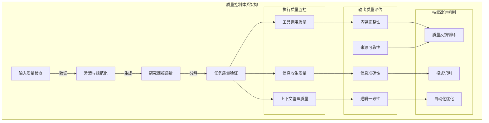

# Open Deep Research 质量控制与评估深度分析

## 🎯 质量保证体系概览

Open Deep Research构建了一个**多维度质量控制体系**，从输入验证到输出评估，确保研究结果的**准确性、完整性和可靠性**。这个体系体现了现代AI系统中**质量工程**和**可信AI**的核心理念。



## 🔍 输入质量控制

### 1. 需求澄清的质量机制

#### 1.1 智能澄清决策

```python
class IntelligentClarificationEngine:
    """智能澄清引擎"""
    
    def __init__(self, llm_model):
        self.llm_model = llm_model
        self.clarification_patterns = {
            "ambiguous_terms": r'\b(?:it|this|that|they|those)\b',
            "vague_quantities": r'\b(?:some|many|few|several|most)\b',
            "unclear_scope": r'\b(?:about|around|regarding|concerning)\b',
            "missing_context": r'\b(?:compare|analyze|evaluate)\b\s+\w+$'
        }
    
    async def evaluate_clarification_need(self, messages: List[dict]) -> dict:
        """评估是否需要澄清以及澄清质量"""
        
        # 1. 结构化分析用户请求
        user_request = self._extract_user_request(messages)
        
        # 2. 多维度质量检查
        quality_checks = await asyncio.gather(
            self._check_specificity(user_request),
            self._check_completeness(user_request),
            self._check_feasibility(user_request),
            self._check_scope_clarity(user_request)
        )
        
        # 3. 综合质量评分
        quality_scores = {
            "specificity": quality_checks[0],
            "completeness": quality_checks[1], 
            "feasibility": quality_checks[2],
            "scope_clarity": quality_checks[3]
        }
        
        overall_quality = sum(quality_scores.values()) / len(quality_scores)
        
        # 4. 决策逻辑
        if overall_quality < 0.6:
            clarification_strategy = await self._generate_clarification_strategy(quality_scores, user_request)
            return {
                "need_clarification": True,
                "quality_score": overall_quality,
                "weak_dimensions": [k for k, v in quality_scores.items() if v < 0.5],
                "clarification_strategy": clarification_strategy
            }
        else:
            return {
                "need_clarification": False,
                "quality_score": overall_quality,
                "validation_message": self._generate_validation_message(user_request)
            }
    
    async def _check_specificity(self, request: str) -> float:
        """检查请求的具体性"""
        specificity_prompt = f"""
        评估以下研究请求的具体性程度(0-1)：
        
        请求: {request}
        
        评估标准:
        - 是否有明确的研究对象
        - 是否有具体的研究维度
        - 是否有明确的产出期望
        - 是否避免了模糊词汇
        
        具体性评分(0-1): """
        
        response = await self.llm_model.ainvoke([HumanMessage(content=specificity_prompt)])
        return self._parse_score(response.content)
    
    async def _check_completeness(self, request: str) -> float:
        """检查请求的完整性"""
        completeness_indicators = [
            "明确的研究目标",
            "具体的比较对象（如果是比较研究）",
            "期望的深度级别",
            "特定的应用场景或用途",
            "时间范围或版本限制"
        ]
        
        completeness_prompt = f"""
        评估研究请求的完整性：
        
        请求: {request}
        
        检查是否包含以下要素：
        {chr(10).join(f"- {indicator}" for indicator in completeness_indicators)}
        
        完整性评分(0-1，1表示包含所有关键要素): """
        
        response = await self.llm_model.ainvoke([HumanMessage(content=completeness_prompt)])
        return self._parse_score(response.content)
    
    async def _generate_clarification_strategy(self, quality_scores: dict, request: str) -> dict:
        """生成针对性的澄清策略"""
        
        # 识别最需要澄清的维度
        weakest_dimension = min(quality_scores.items(), key=lambda x: x[1])
        
        clarification_templates = {
            "specificity": "请提供更具体的{研究对象/比较维度/期望产出}",
            "completeness": "为了更好地完成研究，请补充{缺失的关键信息}",
            "feasibility": "请确认研究的{时间范围/资源限制/数据可获得性}",
            "scope_clarity": "请明确研究的{边界范围/重点领域/排除内容}"
        }
        
        base_template = clarification_templates.get(weakest_dimension[0], "请提供更多具体信息")
        
        # 使用LLM生成个性化澄清问题
        clarification_prompt = f"""
        基于以下分析为用户生成澄清问题：
        
        用户请求: {request}
        质量分析: {quality_scores}
        最弱维度: {weakest_dimension[0]}
        
        生成1-2个具体的澄清问题，帮助用户提供必要信息：
        """
        
        response = await self.llm_model.ainvoke([HumanMessage(content=clarification_prompt)])
        
        return {
            "primary_question": response.content,
            "focus_dimension": weakest_dimension[0],
            "quality_gap": 0.6 - weakest_dimension[1]
        }
```

#### 1.2 研究简报质量验证

```python
class ResearchBriefValidator:
    """研究简报质量验证器"""
    
    def __init__(self, llm_model):
        self.llm_model = llm_model
        self.quality_criteria = {
            "clarity": 0.8,      # 清晰度阈值
            "actionability": 0.7, # 可执行性阈值
            "scope": 0.75,       # 范围合理性阈值
            "decomposability": 0.7 # 可分解性阈值
        }
    
    async def validate_research_brief(self, brief: str, original_messages: List[dict]) -> dict:
        """验证研究简报质量"""
        
        # 1. 多维度质量评估
        quality_assessments = await asyncio.gather(
            self._assess_clarity(brief),
            self._assess_actionability(brief),
            self._assess_scope_appropriateness(brief),
            self._assess_decomposability(brief)
        )
        
        quality_scores = dict(zip(self.quality_criteria.keys(), quality_assessments))
        
        # 2. 一致性检查
        consistency_score = await self._check_consistency_with_original(brief, original_messages)
        
        # 3. 可行性验证
        feasibility_score = await self._assess_research_feasibility(brief)
        
        # 4. 综合质量判断
        overall_quality = (
            sum(quality_scores.values()) * 0.6 +
            consistency_score * 0.25 +
            feasibility_score * 0.15
        ) / 3
        
        # 5. 质量报告生成
        quality_report = {
            "overall_quality": overall_quality,
            "dimension_scores": quality_scores,
            "consistency_score": consistency_score,
            "feasibility_score": feasibility_score,
            "passes_threshold": all(score >= threshold for score, threshold in zip(quality_scores.values(), self.quality_criteria.values())),
            "improvement_suggestions": await self._generate_improvement_suggestions(quality_scores)
        }
        
        return quality_report
    
    async def _assess_clarity(self, brief: str) -> float:
        """评估简报清晰度"""
        clarity_prompt = f"""
        评估以下研究简报的清晰度(0-1)：
        
        简报: {brief}
        
        评估维度:
        - 语言表达是否清晰准确
        - 研究目标是否明确
        - 期望产出是否具体
        - 是否避免歧义表达
        
        清晰度评分(0-1): """
        
        response = await self.llm_model.ainvoke([HumanMessage(content=clarity_prompt)])
        return self._parse_score(response.content)
    
    async def _assess_decomposability(self, brief: str) -> float:
        """评估简报的可分解性"""
        decomposability_prompt = f"""
        评估研究简报是否适合分解为并行子任务(0-1)：
        
        简报: {brief}
        
        评估标准:
        - 是否可以识别独立的研究维度
        - 子任务之间的依赖关系是否最小
        - 是否适合并行执行
        - 分解后的任务是否具有合适的粒度
        
        可分解性评分(0-1): """
        
        response = await self.llm_model.ainvoke([HumanMessage(content=decomposability_prompt)])
        return self._parse_score(response.content)
```

## 🔬 执行过程质量监控

### 1. 实时质量监控系统

#### 1.1 工具调用质量监控

```python
class ToolExecutionQualityMonitor:
    """工具执行质量监控器"""
    
    def __init__(self):
        self.quality_metrics = {
            "success_rate": 0.95,      # 成功率阈值
            "response_relevance": 0.8,  # 响应相关性阈值  
            "information_density": 0.6, # 信息密度阈值
            "source_reliability": 0.7   # 来源可靠性阈值
        }
        self.quality_history = []
    
    async def monitor_tool_execution(self, tool_name: str, inputs: dict, outputs: str, context: dict) -> dict:
        """监控单次工具执行质量"""
        
        # 1. 基础质量指标
        execution_success = not outputs.startswith("Error")
        response_length = len(outputs)
        
        # 2. 深度质量分析
        quality_scores = await asyncio.gather(
            self._assess_response_relevance(inputs, outputs, context),
            self._assess_information_density(outputs),
            self._assess_source_reliability(outputs, tool_name),
            self._assess_content_freshness(outputs)
        )
        
        quality_assessment = {
            "tool_name": tool_name,
            "execution_success": execution_success,
            "response_length": response_length,
            "relevance_score": quality_scores[0],
            "density_score": quality_scores[1],
            "reliability_score": quality_scores[2],
            "freshness_score": quality_scores[3],
            "timestamp": time.time()
        }
        
        # 3. 综合质量评分
        overall_quality = self._calculate_overall_quality(quality_assessment)
        quality_assessment["overall_quality"] = overall_quality
        
        # 4. 质量预警
        quality_alerts = self._check_quality_alerts(quality_assessment)
        
        # 5. 记录历史
        self.quality_history.append(quality_assessment)
        
        return {
            "quality_assessment": quality_assessment,
            "quality_alerts": quality_alerts,
            "improvement_recommendations": await self._generate_tool_improvement_recommendations(quality_assessment)
        }
    
    async def _assess_response_relevance(self, inputs: dict, outputs: str, context: dict) -> float:
        """评估响应相关性"""
        relevance_prompt = f"""
        评估工具响应与输入查询的相关性(0-1)：
        
        输入查询: {inputs}
        工具响应: {outputs[:1000]}...
        研究上下文: {context.get('research_topic', '')}
        
        评估标准:
        - 响应是否直接回答了查询问题
        - 内容是否与研究主题相关
        - 信息是否具有实用价值
        - 是否包含无关或噪音信息
        
        相关性评分(0-1): """
        
        # 实际实现中应该调用LLM
        # response = await self.llm_model.ainvoke([HumanMessage(content=relevance_prompt)])
        # return self._parse_score(response.content)
        
        # 简化实现：基于关键词匹配的相关性分析
        query_keywords = set(str(inputs).lower().split())
        response_keywords = set(outputs.lower().split())
        
        if not query_keywords:
            return 0.5
        
        overlap = len(query_keywords & response_keywords)
        return min(1.0, overlap / len(query_keywords))
    
    async def _assess_information_density(self, outputs: str) -> float:
        """评估信息密度"""
        if not outputs or len(outputs) < 50:
            return 0.1
        
        # 简单的信息密度评估
        words = outputs.split()
        unique_words = set(word.lower() for word in words if len(word) > 3)
        
        # 信息密度 = 独特词汇比例 * 长度因子
        uniqueness_ratio = len(unique_words) / max(len(words), 1)
        length_factor = min(1.0, len(outputs) / 1000)  # 1000字符为基准
        
        return min(1.0, uniqueness_ratio * 2 * length_factor)
    
    def _check_quality_alerts(self, assessment: dict) -> List[dict]:
        """检查质量预警"""
        alerts = []
        
        # 成功率预警
        if not assessment["execution_success"]:
            alerts.append({
                "type": "execution_failure",
                "severity": "high",
                "message": f"工具 {assessment['tool_name']} 执行失败"
            })
        
        # 相关性预警
        if assessment["relevance_score"] < self.quality_metrics["response_relevance"]:
            alerts.append({
                "type": "low_relevance",
                "severity": "medium",
                "message": f"响应相关性过低: {assessment['relevance_score']:.2f}"
            })
        
        # 信息密度预警
        if assessment["density_score"] < self.quality_metrics["information_density"]:
            alerts.append({
                "type": "low_information_density",
                "severity": "medium", 
                "message": f"信息密度不足: {assessment['density_score']:.2f}"
            })
        
        return alerts
```

#### 1.2 研究进展质量追踪

```python
class ResearchProgressQualityTracker:
    """研究进展质量追踪器"""
    
    def __init__(self):
        self.progress_checkpoints = []
        self.quality_trends = {}
        self.completeness_indicators = {
            "breadth_coverage": 0.8,    # 广度覆盖度
            "depth_sufficiency": 0.75,  # 深度充分性
            "source_diversity": 0.7,    # 来源多样性
            "evidence_strength": 0.8    # 证据强度
        }
    
    async def track_research_progress(self, current_results: List[str], research_brief: str, iteration: int) -> dict:
        """追踪研究进展质量"""
        
        # 1. 进展质量评估
        progress_quality = await asyncio.gather(
            self._assess_breadth_coverage(current_results, research_brief),
            self._assess_depth_sufficiency(current_results, research_brief),
            self._assess_source_diversity(current_results),
            self._assess_evidence_strength(current_results)
        )
        
        quality_scores = dict(zip(self.completeness_indicators.keys(), progress_quality))
        
        # 2. 进展趋势分析
        if len(self.progress_checkpoints) > 0:
            trend_analysis = self._analyze_quality_trends(quality_scores)
        else:
            trend_analysis = {"trend": "initial", "improvement_rate": 0}
        
        # 3. 完整性评估
        completeness_assessment = await self._assess_research_completeness(quality_scores, research_brief)
        
        # 4. 质量检查点记录
        checkpoint = {
            "iteration": iteration,
            "timestamp": time.time(),
            "quality_scores": quality_scores,
            "completeness": completeness_assessment["completeness_score"],
            "total_results": len(current_results)
        }
        self.progress_checkpoints.append(checkpoint)
        
        # 5. 决策建议
        decision_recommendation = await self._generate_progress_decision(
            quality_scores, completeness_assessment, trend_analysis
        )
        
        return {
            "quality_scores": quality_scores,
            "trend_analysis": trend_analysis,
            "completeness_assessment": completeness_assessment,
            "decision_recommendation": decision_recommendation,
            "quality_alerts": self._check_progress_quality_alerts(quality_scores)
        }
    
    async def _assess_breadth_coverage(self, results: List[str], brief: str) -> float:
        """评估研究广度覆盖"""
        
        # 提取研究应该覆盖的关键维度
        expected_dimensions = await self._extract_research_dimensions(brief)
        
        # 分析当前结果覆盖的维度
        covered_dimensions = set()
        for result in results:
            result_dimensions = await self._extract_covered_dimensions(result)
            covered_dimensions.update(result_dimensions)
        
        # 计算覆盖度
        if not expected_dimensions:
            return 0.8  # 默认较好覆盖
        
        coverage_ratio = len(covered_dimensions & expected_dimensions) / len(expected_dimensions)
        return min(1.0, coverage_ratio)
    
    async def _assess_depth_sufficiency(self, results: List[str], brief: str) -> float:
        """评估研究深度充分性"""
        
        depth_indicators = {
            "detailed_analysis": 0,      # 详细分析
            "multiple_perspectives": 0,   # 多角度视角
            "evidence_support": 0,       # 证据支撑
            "expert_opinions": 0,        # 专家观点
            "quantitative_data": 0       # 量化数据
        }
        
        total_content = "\n".join(results)
        
        # 简化的深度评估（实际应该使用更复杂的NLP分析）
        if "分析" in total_content or "analysis" in total_content.lower():
            depth_indicators["detailed_analysis"] = 1
        
        if "观点" in total_content or "perspective" in total_content.lower():
            depth_indicators["multiple_perspectives"] = 1
        
        if "数据" in total_content or "研究" in total_content:
            depth_indicators["evidence_support"] = 1
        
        # 计算深度分数
        depth_score = sum(depth_indicators.values()) / len(depth_indicators)
        return depth_score
    
    def _analyze_quality_trends(self, current_scores: dict) -> dict:
        """分析质量趋势"""
        if len(self.progress_checkpoints) < 2:
            return {"trend": "insufficient_data", "improvement_rate": 0}
        
        # 计算最近几次的质量改进
        recent_checkpoints = self.progress_checkpoints[-3:]  # 最近3次
        
        quality_changes = []
        for i in range(1, len(recent_checkpoints)):
            prev_scores = recent_checkpoints[i-1]["quality_scores"]
            curr_scores = recent_checkpoints[i]["quality_scores"]
            
            avg_change = sum(
                curr_scores[key] - prev_scores.get(key, 0)
                for key in curr_scores.keys()
            ) / len(curr_scores)
            
            quality_changes.append(avg_change)
        
        # 趋势分析
        if not quality_changes:
            return {"trend": "stable", "improvement_rate": 0}
        
        avg_improvement = sum(quality_changes) / len(quality_changes)
        
        if avg_improvement > 0.05:
            trend = "improving"
        elif avg_improvement < -0.05:
            trend = "declining"
        else:
            trend = "stable"
        
        return {
            "trend": trend,
            "improvement_rate": avg_improvement,
            "consistency": self._calculate_trend_consistency(quality_changes)
        }
```

## 📝 输出质量评估

### 1. 最终报告质量评估

#### 1.1 多维度质量评估框架

```python
class FinalReportQualityAssessor:
    """最终报告质量评估器"""
    
    def __init__(self, llm_model):
        self.llm_model = llm_model
        self.quality_dimensions = {
            "content_accuracy": {
                "weight": 0.25,
                "threshold": 0.85,
                "description": "内容准确性和事实正确性"
            },
            "structural_coherence": {
                "weight": 0.20,
                "threshold": 0.80,
                "description": "结构连贯性和逻辑性"
            },
            "completeness": {
                "weight": 0.25,
                "threshold": 0.85,
                "description": "信息完整性和覆盖度"
            },
            "source_credibility": {
                "weight": 0.15,
                "threshold": 0.75,
                "description": "信息来源可信度"
            },
            "actionability": {
                "weight": 0.15,
                "threshold": 0.70,
                "description": "实用性和可操作性"
            }
        }
    
    async def assess_final_report_quality(self, 
                                        report: str, 
                                        research_brief: str, 
                                        source_materials: List[str]) -> dict:
        """全面评估最终报告质量"""
        
        # 1. 并行执行多维度评估
        assessment_tasks = [
            self._assess_content_accuracy(report, source_materials),
            self._assess_structural_coherence(report),
            self._assess_completeness(report, research_brief),
            self._assess_source_credibility(report, source_materials),
            self._assess_actionability(report, research_brief)
        ]
        
        dimension_scores = await asyncio.gather(*assessment_tasks)
        
        # 2. 构建评估结果
        quality_assessment = {}
        for i, (dimension, config) in enumerate(self.quality_dimensions.items()):
            score = dimension_scores[i]
            quality_assessment[dimension] = {
                "score": score,
                "threshold": config["threshold"],
                "passes": score >= config["threshold"],
                "weight": config["weight"]
            }
        
        # 3. 计算加权总分
        weighted_score = sum(
            assessment["score"] * assessment["weight"]
            for assessment in quality_assessment.values()
        )
        
        # 4. 生成质量报告
        quality_report = {
            "overall_score": weighted_score,
            "dimension_scores": quality_assessment,
            "passes_threshold": weighted_score >= 0.80,  # 总体阈值
            "quality_grade": self._calculate_quality_grade(weighted_score),
            "improvement_areas": [
                dim for dim, assessment in quality_assessment.items()
                if not assessment["passes"]
            ],
            "strengths": [
                dim for dim, assessment in quality_assessment.items()
                if assessment["score"] >= assessment["threshold"] + 0.1
            ]
        }
        
        # 5. 生成详细分析和建议
        detailed_analysis = await self._generate_detailed_quality_analysis(
            report, quality_assessment, research_brief
        )
        
        return {
            "quality_report": quality_report,
            "detailed_analysis": detailed_analysis,
            "recommendations": await self._generate_quality_improvement_recommendations(quality_report)
        }
    
    async def _assess_content_accuracy(self, report: str, source_materials: List[str]) -> float:
        """评估内容准确性"""
        accuracy_prompt = f"""
        评估研究报告的内容准确性(0-1)：
        
        报告内容: {report[:2000]}...
        
        来源材料: {chr(10).join(source[:500] for source in source_materials[:3])}...
        
        评估标准:
        - 事实陈述是否准确
        - 数据引用是否正确
        - 结论是否基于证据
        - 是否存在明显错误
        
        准确性评分(0-1): """
        
        response = await self.llm_model.ainvoke([HumanMessage(content=accuracy_prompt)])
        return self._parse_score(response.content)
    
    async def _assess_structural_coherence(self, report: str) -> float:
        """评估结构连贯性"""
        coherence_prompt = f"""
        评估研究报告的结构连贯性(0-1)：
        
        报告内容: {report}
        
        评估标准:
        - 逻辑结构是否清晰
        - 段落间过渡是否自然
        - 论证是否连贯
        - 结论是否与内容一致
        
        连贯性评分(0-1): """
        
        response = await self.llm_model.ainvoke([HumanMessage(content=coherence_prompt)])
        return self._parse_score(response.content)
    
    def _calculate_quality_grade(self, weighted_score: float) -> str:
        """计算质量等级"""
        if weighted_score >= 0.95:
            return "优秀 (A+)"
        elif weighted_score >= 0.90:
            return "优秀 (A)"
        elif weighted_score >= 0.85:
            return "良好 (B+)"
        elif weighted_score >= 0.80:
            return "良好 (B)"
        elif weighted_score >= 0.75:
            return "中等 (C+)"
        elif weighted_score >= 0.70:
            return "中等 (C)"
        else:
            return "需要改进 (D)"
```

#### 1.2 自动化质量改进建议

```python
class QualityImprovementRecommendationEngine:
    """质量改进建议引擎"""
    
    def __init__(self, llm_model):
        self.llm_model = llm_model
        self.improvement_strategies = {
            "content_accuracy": [
                "增加事实核查步骤",
                "引用更权威的信息源",
                "添加数据验证机制",
                "进行交叉验证"
            ],
            "structural_coherence": [
                "重新组织逻辑结构",
                "添加段落间的过渡句",
                "统一论证风格",
                "明确结论与证据的关系"
            ],
            "completeness": [
                "补充遗漏的关键信息",
                "扩展分析深度",
                "增加多角度视角",
                "添加实例和案例"
            ],
            "source_credibility": [
                "使用更权威的信息源",
                "增加来源多样性",
                "添加来源验证",
                "引用最新资料"
            ],
            "actionability": [
                "提供具体的行动建议",
                "添加实施步骤",
                "包含可量化的指标",
                "给出时间线规划"
            ]
        }
    
    async def generate_improvement_recommendations(self, quality_report: dict, report_content: str) -> dict:
        """生成质量改进建议"""
        
        improvement_areas = quality_report["improvement_areas"]
        
        if not improvement_areas:
            return {
                "status": "no_improvement_needed",
                "message": "报告质量已达到标准，无需改进"
            }
        
        # 1. 针对每个问题维度生成具体建议
        dimension_recommendations = {}
        for dimension in improvement_areas:
            current_score = quality_report["dimension_scores"][dimension]["score"]
            target_score = quality_report["dimension_scores"][dimension]["threshold"]
            
            specific_recommendations = await self._generate_specific_recommendations(
                dimension, current_score, target_score, report_content
            )
            
            dimension_recommendations[dimension] = {
                "current_score": current_score,
                "target_score": target_score,
                "improvement_gap": target_score - current_score,
                "specific_recommendations": specific_recommendations,
                "priority": self._calculate_improvement_priority(dimension, current_score, target_score)
            }
        
        # 2. 生成改进计划
        improvement_plan = await self._create_improvement_plan(dimension_recommendations)
        
        # 3. 估算改进效果
        expected_improvement = self._estimate_improvement_impact(dimension_recommendations, quality_report)
        
        return {
            "improvement_areas": dimension_recommendations,
            "improvement_plan": improvement_plan,
            "expected_improvement": expected_improvement,
            "implementation_timeline": self._create_implementation_timeline(improvement_plan)
        }
    
    async def _generate_specific_recommendations(self, 
                                               dimension: str, 
                                               current_score: float, 
                                               target_score: float, 
                                               report_content: str) -> List[str]:
        """为特定维度生成具体改进建议"""
        
        base_strategies = self.improvement_strategies.get(dimension, [])
        
        # 使用LLM生成针对性建议
        recommendation_prompt = f"""
        为提高研究报告的{dimension}质量生成具体改进建议：
        
        当前评分: {current_score:.2f}
        目标评分: {target_score:.2f}
        改进缺口: {target_score - current_score:.2f}
        
        报告内容片段: {report_content[:1000]}...
        
        基础策略: {', '.join(base_strategies)}
        
        请生成3-5个具体的、可操作的改进建议：
        """
        
        response = await self.llm_model.ainvoke([HumanMessage(content=recommendation_prompt)])
        
        # 解析LLM响应为建议列表
        recommendations = self._parse_recommendations(response.content)
        
        return recommendations
    
    def _calculate_improvement_priority(self, dimension: str, current_score: float, target_score: float) -> str:
        """计算改进优先级"""
        improvement_gap = target_score - current_score
        dimension_weight = self.quality_dimensions.get(dimension, {}).get("weight", 0.2)
        
        priority_score = improvement_gap * dimension_weight
        
        if priority_score > 0.05:
            return "高"
        elif priority_score > 0.02:
            return "中"
        else:
            return "低"
    
    async def _create_improvement_plan(self, dimension_recommendations: dict) -> dict:
        """创建改进计划"""
        
        # 按优先级排序维度
        sorted_dimensions = sorted(
            dimension_recommendations.items(),
            key=lambda x: {"高": 3, "中": 2, "低": 1}[x[1]["priority"]],
            reverse=True
        )
        
        improvement_phases = []
        current_phase = []
        
        for dimension, recommendation in sorted_dimensions:
            if recommendation["priority"] == "高":
                current_phase.append({
                    "dimension": dimension,
                    "actions": recommendation["specific_recommendations"][:2],  # 前2个最重要的行动
                    "expected_time": "1-2天"
                })
            elif recommendation["priority"] == "中" and len(current_phase) < 3:
                current_phase.append({
                    "dimension": dimension,
                    "actions": recommendation["specific_recommendations"][:1],  # 前1个行动
                    "expected_time": "半天"
                })
            
            # 每3个维度组成一个阶段
            if len(current_phase) >= 3:
                improvement_phases.append(current_phase)
                current_phase = []
        
        # 处理剩余的维度
        if current_phase:
            improvement_phases.append(current_phase)
        
        return {
            "phases": improvement_phases,
            "total_phases": len(improvement_phases),
            "estimated_total_time": f"{len(improvement_phases) * 2}-{len(improvement_phases) * 3}天"
        }
```

## 🔄 持续质量改进机制

### 1. 质量反馈循环

```python
class QualityFeedbackLoop:
    """质量反馈循环系统"""
    
    def __init__(self):
        self.quality_history = []
        self.improvement_tracking = {}
        self.quality_patterns = {}
    
    async def collect_quality_feedback(self, 
                                     session_id: str,
                                     quality_metrics: dict,
                                     user_feedback: Optional[dict] = None) -> dict:
        """收集质量反馈"""
        
        feedback_entry = {
            "session_id": session_id,
            "timestamp": time.time(),
            "quality_metrics": quality_metrics,
            "user_feedback": user_feedback,
            "system_performance": await self._collect_system_metrics()
        }
        
        self.quality_history.append(feedback_entry)
        
        # 分析质量趋势
        quality_trends = await self._analyze_quality_trends()
        
        # 识别改进机会
        improvement_opportunities = await self._identify_improvement_opportunities(feedback_entry)
        
        # 更新质量模式
        await self._update_quality_patterns(feedback_entry)
        
        return {
            "feedback_recorded": True,
            "quality_trends": quality_trends,
            "improvement_opportunities": improvement_opportunities,
            "recommendations": await self._generate_system_recommendations(quality_trends)
        }
    
    async def _analyze_quality_trends(self) -> dict:
        """分析质量趋势"""
        if len(self.quality_history) < 5:
            return {"trend": "insufficient_data"}
        
        recent_sessions = self.quality_history[-10:]  # 最近10个会话
        
        # 计算各维度的趋势
        trend_analysis = {}
        
        for dimension in ["overall_score", "content_accuracy", "completeness", "actionability"]:
            scores = [
                session["quality_metrics"].get(dimension, 0.5)
                for session in recent_sessions
                if dimension in session["quality_metrics"]
            ]
            
            if len(scores) >= 3:
                # 简单线性趋势分析
                trend_slope = self._calculate_trend_slope(scores)
                trend_analysis[dimension] = {
                    "slope": trend_slope,
                    "direction": "improving" if trend_slope > 0.01 else "declining" if trend_slope < -0.01 else "stable",
                    "current_average": sum(scores[-3:]) / 3,  # 最近3次平均
                    "variance": self._calculate_variance(scores)
                }
        
        return trend_analysis
    
    async def _identify_improvement_opportunities(self, feedback_entry: dict) -> List[dict]:
        """识别改进机会"""
        opportunities = []
        
        quality_metrics = feedback_entry["quality_metrics"]
        user_feedback = feedback_entry.get("user_feedback", {})
        
        # 基于质量指标的改进机会
        for dimension, score in quality_metrics.items():
            if isinstance(score, (int, float)) and score < 0.8:
                opportunities.append({
                    "type": "quality_metric",
                    "dimension": dimension,
                    "current_score": score,
                    "improvement_potential": 0.9 - score,
                    "priority": "high" if score < 0.7 else "medium"
                })
        
        # 基于用户反馈的改进机会
        if user_feedback:
            satisfaction_score = user_feedback.get("satisfaction", 0.8)
            if satisfaction_score < 0.8:
                opportunities.append({
                    "type": "user_satisfaction",
                    "current_score": satisfaction_score,
                    "feedback_details": user_feedback.get("comments", ""),
                    "priority": "high"
                })
        
        # 基于系统性能的改进机会
        system_metrics = feedback_entry["system_performance"]
        if system_metrics.get("response_time", 0) > 120:  # 超过2分钟
            opportunities.append({
                "type": "performance",
                "metric": "response_time",
                "current_value": system_metrics["response_time"],
                "target_value": 90,
                "priority": "medium"
            })
        
        return sorted(opportunities, key=lambda x: {"high": 3, "medium": 2, "low": 1}[x["priority"]], reverse=True)
```

### 2. 自适应质量标准

```python
class AdaptiveQualityStandards:
    """自适应质量标准系统"""
    
    def __init__(self):
        self.dynamic_thresholds = {
            "content_accuracy": 0.85,
            "completeness": 0.80,
            "coherence": 0.75,
            "actionability": 0.70
        }
        self.context_modifiers = {}
        self.performance_history = []
    
    async def adjust_quality_standards(self, context: dict, historical_performance: List[dict]) -> dict:
        """根据上下文和历史表现调整质量标准"""
        
        # 1. 分析上下文因素
        context_factors = await self._analyze_context_factors(context)
        
        # 2. 评估历史表现
        performance_analysis = self._analyze_historical_performance(historical_performance)
        
        # 3. 计算调整因子
        adjustment_factors = await self._calculate_adjustment_factors(context_factors, performance_analysis)
        
        # 4. 应用自适应调整
        adjusted_thresholds = {}
        for dimension, base_threshold in self.dynamic_thresholds.items():
            adjustment = adjustment_factors.get(dimension, 0)
            adjusted_threshold = base_threshold + adjustment
            
            # 确保阈值在合理范围内
            adjusted_threshold = max(0.5, min(0.95, adjusted_threshold))
            adjusted_thresholds[dimension] = adjusted_threshold
        
        # 5. 记录调整历史
        adjustment_record = {
            "timestamp": time.time(),
            "context": context,
            "base_thresholds": self.dynamic_thresholds.copy(),
            "adjusted_thresholds": adjusted_thresholds,
            "adjustment_factors": adjustment_factors
        }
        
        return {
            "adjusted_thresholds": adjusted_thresholds,
            "adjustment_rationale": await self._generate_adjustment_rationale(adjustment_factors, context),
            "expected_impact": self._estimate_adjustment_impact(adjustment_factors),
            "adjustment_record": adjustment_record
        }
    
    async def _analyze_context_factors(self, context: dict) -> dict:
        """分析影响质量标准的上下文因素"""
        
        factors = {
            "complexity": 0,      # 研究复杂度
            "urgency": 0,         # 紧急程度
            "domain": 0,          # 领域专业性
            "scope": 0,           # 研究范围
            "resources": 0        # 可用资源
        }
        
        # 复杂度评估
        research_brief = context.get("research_brief", "")
        if len(research_brief.split()) > 100:
            factors["complexity"] += 0.1
        if "比较" in research_brief or "compare" in research_brief.lower():
            factors["complexity"] += 0.05
        
        # 紧急程度
        time_constraint = context.get("time_constraint", "normal")
        if time_constraint == "urgent":
            factors["urgency"] = 0.1
        elif time_constraint == "relaxed":
            factors["urgency"] = -0.05
        
        # 领域专业性
        domain_keywords = ["技术", "scientific", "academic", "research"]
        if any(keyword in research_brief.lower() for keyword in domain_keywords):
            factors["domain"] = 0.05
        
        return factors
    
    def _analyze_historical_performance(self, historical_performance: List[dict]) -> dict:
        """分析历史表现模式"""
        if len(historical_performance) < 5:
            return {"trend": "insufficient_data", "average_performance": 0.8}
        
        recent_performance = historical_performance[-10:]  # 最近10次
        
        # 计算各维度的平均表现
        dimension_averages = {}
        for dimension in self.dynamic_thresholds.keys():
            scores = [
                perf.get(dimension, 0.8) 
                for perf in recent_performance 
                if dimension in perf
            ]
            if scores:
                dimension_averages[dimension] = sum(scores) / len(scores)
        
        # 整体趋势分析
        overall_scores = [
            sum(perf.values()) / len(perf) 
            for perf in recent_performance 
            if perf
        ]
        
        trend_slope = self._calculate_trend_slope(overall_scores) if overall_scores else 0
        
        return {
            "dimension_averages": dimension_averages,
            "overall_trend": trend_slope,
            "performance_stability": self._calculate_variance(overall_scores) if overall_scores else 0.1
        }
```

## 🎯 面试要点总结

### 核心技术概念

1. **多维度质量评估**: 从输入到输出的全流程质量控制
2. **实时质量监控**: 执行过程中的质量追踪和预警
3. **自适应质量标准**: 基于上下文和历史表现的动态调整
4. **质量反馈循环**: 持续改进的闭环质量管理

### 系统设计能力展示

1. **质量架构设计**: 分层的质量保证体系
2. **监控体系**: 实时质量监控和预警机制
3. **评估框架**: 多维度、可量化的质量评估
4. **改进机制**: 自动化的质量改进建议和实施

### 技术深度讨论

1. **质量建模**: 如何将主观质量转化为客观指标
2. **实时评估**: 大规模系统中的性能优化质量监控
3. **自适应机制**: 动态调整质量标准的算法设计
4. **人机结合**: AI评估与人工反馈的有效结合

### 实际应用价值

1. **质量保证**: 确保AI系统输出的可靠性
2. **持续改进**: 通过反馈循环不断提升系统质量
3. **风险控制**: 及时发现和处理质量问题
4. **用户满意度**: 通过质量控制提升用户体验

---

这种全面的质量控制与评估体系体现了可信AI系统的核心要求，通过多层次的质量保证机制确保了研究结果的准确性和可靠性。 